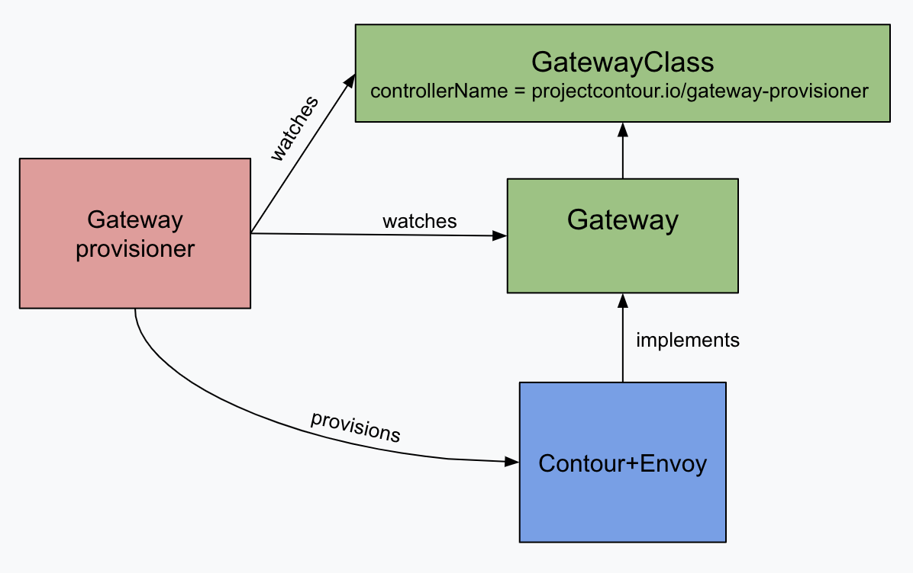
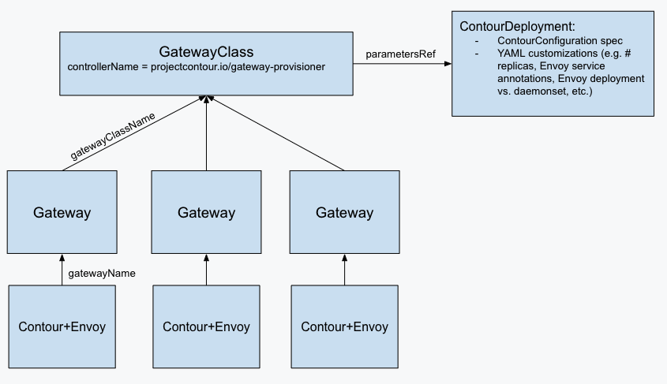

# Contour - Automated Provisioning

## Abstract
This document proposes a path forward in the area of automated provisioning of Contour + Envoy instances.
It describes several alternatives and explains why the proposed plan was selected as the preferred one.

## Background
The Contour Operator was initially created in August 2020 to provide automated provisioning of Contour instances.
Its first alpha/experimental release was in December 2020, and it has remained in alpha/experimental status since then.
It had significant development through July 2021, at which point the primary maintainer and contributor stepped away from the project.
Since then, it has been minimally developed, and remains alpha/experimental.

Over the same time, Contour has also made a significant investment in implementing the [Gateway API](https://gateway-api.sigs.k8s.io/).
There have been several evolutions of Contour’s implementation over that time period.
One gap we see in Contour’s current implementation is that it lacks support for fully automated provisioning of Contour + Envoy instances, based on a user’s definition of a Gateway custom resource.
This gap prevents Contour from having a fully conformant Gateway API implementation.

## Terminology
In this document, I’ll use the terms **static provisioning** and **dynamic provisioning**, borrowed from the [Kubernetes storage world](https://kubernetes.io/docs/concepts/storage/persistent-volumes/#provisioning).
- **Static provisioning** refers to a user manually deploying a Contour + Envoy instance, plus a Gateway custom resource that describes that Contour + Envoy instance. No automated provisioners are involved; the work is performed by a human. It’s up to that human to ensure that the Gateway spec matches the deployed Contour + Envoy’s configuration.
- **Dynamic provisioning** refers to the process where a **Gateway provisioner** (a controller running in the cluster) reacts to the creation of a Gateway custom resource by deploying a Contour + Envoy instance that matches the Gateway’s spec. In this process, a human defines a request for load balancing infrastructure, via the Gateway custom resource, and the Gateway provisioner is responsible for fulfilling that request. This term also encompasses the ongoing reconciliation loop between the Gateway custom resource and the underlying Contour + Envoy resources, as well as the deletion process.

It’s possible that we’ll decide on different terms for these concepts going forward (e.g. “managed” vs. “unmanaged”), but this document will stick with the ones defined above.

## Goals
- Create an optional dynamic Gateway provisioner, implemented in `projectcontour/contour` as a subcommand of the `contour` binary and deployed as a separate Deployment, in order to have a conformant Gateway API implementation.
- Support all major functionality that the Contour operator/`Contour` CRD currently provide within the Gateway provisioner.
- Deprecate the Contour operator and associated `Contour` CRD, to focus effort on the Gateway provisioner.

## Design
The Contour Operator, including the `operator.projectcontour.io/Contour` CRD, will be deprecated.
We will continue to make the minimal updates required to keep it functioning as-is, and ship new releases as we ship Contour releases, until all of the following conditions are met:
- Gateway API reaches beta (which is expected to be soon, i.e by mid-year 2022)
- Contour ships its first release supporting the beta Gateway API
- The Contour Gateway provisioner (described below) provides equivalent functionality for what the Operator currently offers

At that point we will stop maintaining the Operator, including the Contour CRD, and put it in archive mode.
This conservative deprecation schedule should give current Operator users enough time to migrate off of it, along with a viable alternative (described below).

A new subcommand will be added to the contour binary within the `projectcontour/contour` repository, here called the Gateway provisioner.
This subcommand will implement dynamic Gateway provisioning functionality, as described previously.
Initially, a good portion of the existing Contour Operator code will be copied into `projectcontour/contour` to provide the required functionality; this code will be modified as needed to fully support the Gateway use cases and to more closely adhere to existing Contour code style and standards.

Use of the Gateway provisioner will be optional.
While it will be required to have a fully conformant implementation of Gateway API, users who are not interested in dynamic Gateway/Contour provisioning or the Gateway API in general are not required to use it.
It will, however, be the only supported way to dynamically provision Contour instances.
It is worth noting that Contour instances deployed by the Gateway provisioner are still fully capable of processing Ingress and HTTPProxy resources.
This allows for the possibility of using the Gateway API and Gateway provisioner solely as a means of *provisioning* Contour, while continuing to use Ingress and/or HTTPProxy for defining routing configuration.
This also allows the Contour team to focus on implementing *one* standardized provisioning API, as opposed to both Gateway API and the experimental `Contour` CRD.
We believe this is a more effective use of our efforts.

The Gateway provisioner will run as a Deployment in-cluster.
It will watch for GatewayClasses that have a `spec.controller` value matching what the Gateway provisioner has been configured with (e.g. `projectcontour.io/gateway-controller`).
It will set the `Accepted: true` condition on these GatewayClasses, if their `spec.parametersRef` is valid (more on GatewayClass parameters below).

It will also watch for Gateways that use a GatewayClass controlled by it.
It will handle the full provisioning lifecycle for these Gateways: creating a Contour + Envoy instance for new Gateways; continuously ensuring that the Gateway spec and the Contour + Envoy instance’s configuration remain in sync; and deleting the Contour + Envoy instance when the Gateway is deleted.

Importantly, this provisioning model allows for (a) any number of GatewayClasses to be controlled by the Gateway provisioner; and (b) any number of Gateways per controlled GatewayClass.
While the exact use cases for many Contour Gateways remain unclear, these one-to-many relationships between controller and GatewayClass, and GatewayClass and Gateway, offer users the full flexibility that the Gateway API spec intends. 
Additionally, support for this one-to-many relationship is required in order to pass any of the Gateway API conformance tests.

Longer-term, we think there is an opportunity to have multiple Gateways be combined into a single Contour+Envoy instance, by supporting more listeners, collapsing compatible listeners, etc.
We are not attempting to solve that more complex problem in this design document, but the solution proposed here should take us in the right direction.

Contour itself will continue to handle the vast majority of the Gateway and HTTPRoute/TLSRoute validation and processing.
It is responsible for programming Envoy to fulfill the Gateway and route specs, and for setting appropriate conditions on resources.
The provisioner is solely responsible for deploying Contour + Envoy instances, and for setting the “Scheduled” condition on Gateways.

Again, the Gateway provisioner will be an optional component; users who are not interested in Gateway API or dynamic provisioning of Gateways are not required to use it.
Those users can continue to statically provision their Contour + Envoy instances, for use with either Gateway API or traditional Ingress / HTTPProxy.

There will be two ways to configure Contour for Gateway API support in the static provisioning scenario:
- **Controller name** - this is the model implemented today, where Contour is configured with a controller name, and it continuously looks for the oldest GatewayClass with that controller, and the oldest Gateway using that GatewayClass. This model is appropriate for users who expect their GatewayClasses and Gateways to come and go, and who want their Contour instance to dynamically pick up the appropriate Gateway as those changes occur.
- **Gateway name** - Contour can alternately be directly configured with a specific Gateway name, which avoids the multiple levels of indirection of the previous model. This model is appropriate for users who expect their Contour instance to correspond to a single static Gateway; the lifecycle of the Gateway and the lifecycle of the Contour instance are tied together. 

Note that the Gateway provisioner will make use of the **Gateway name** mode of configuring Contour, to tie each instance of Contour it provisions directly to a specific Gateway.

### GatewayClass Parameters

Drawing on [design work already done](https://github.com/projectcontour/contour/blob/main/design/configuration-crd.md), the Gateway provisioner’s GatewayClasses will support configuration parameter references to ContourDeployment custom resources.
This custom resource definition embeds a ContourConfiguration spec, as well as additional fields that control the precise details of the Contour + Envoy resources’ YAML specs (e.g. replicas, node placement, etc.)
This ContourDeployment resource serves as a template that defines exactly how to customize each Contour + Envoy instance that is created for this GatewayClass.
When a Gateway is provisioned, the Gateway provisioner will use the configuration options specified to customize the YAML that is applied, and will pass through a copy of the ContourConfiguration data to the Gateway’s Contour instance.

Note that, according to the Gateway API documentation: 
> It is recommended that [GatewayClass] be used as a template for Gateways.
> This means that a Gateway is based on the state of the GatewayClass at the time it was created and changes to the GatewayClass or associated parameters are not propagated down to existing Gateways.
> This recommendation is intended to limit the blast radius of changes to GatewayClass or associated parameters. 
(ref. [GatewayClass API reference documentation](https://gateway-api.sigs.k8s.io/v1alpha2/references/spec/#gateway.networking.k8s.io/v1alpha2.GatewayClass)) 

For Contour, this means that after a Gateway has been provisioned, the Gateway provisioner will not apply subsequent changes to the GatewayClass/ContourDeployment to it.  
This also means that Contour users can modify the ContourConfigurations used by their running Contours after instantiation, without having those changes overwritten by the Gateway provisioner.

Since the Gateway provisioner supports multiple GatewayClasses, each GatewayClass can have a different ContourDeployment reference, corresponding to different sets of Gateway configuration profiles that the infrastructure provider offers (e.g. an external vs. internal profile).
Gateways are then provisioned simply by referencing the desired GatewayClass/configuration profile.

### Relationship to Managed Envoy
https://github.com/projectcontour/contour/blob/main/design/gateway-apis-implementation.md#managed--unmanaged-envoy

This proposal is related to, but separate from, the managed Envoy proposal:

- If we implement managed Envoy, then the Gateway provisioner has less to do: provision the Contour, pass configuration along, and the Contour will provision Envoy.
- If we don’t implement managed Envoy, then the Gateway provisioner implements the Envoy provisioning logic.
- Either way, the logic needs to be implemented and live somewhere.

Advantages of doing managed Envoy: 
- Users who don’t want automated Gateway provisioning, but do want automated Envoy provisioning, can have it
- Users who don’t want to use Gateway API can still take advantage of automated Envoy provisioning
- Listener programming (combo of Envoy service + Envoy listeners) can be done in one place

Disadvantages of doing managed Envoy:
- Lots of code churn in Contour proper, potentially harder to isolate while still in development/alpha than if implemented in an entirely new component.

## Alternatives Considered
### Alternative 1
We considered continuing to invest in the Contour Operator, including the Contour CRD, with an eye towards bringing it to beta and eventually GA, and implementing the Gateway provisioner within the Operator (since they would share much of the underlying logic).
Our first challenge with this option is that we have failed to establish a community of contributors around the Operator, so the work would need to be done by the core Contour team of maintainers, which would detract from Contour development.
Our second challenge is that we have seen and heard of only limited usage of the Operator in the wild, so it’s not clear to us that continuing to develop it is an important priority for our users.
Finally, continuing to maintain the Operator in a separate repository creates development overhead, since various bits of code and configuration must be manually kept in sync between Contour and the Operator. 

### Alternative 2
We also considered converting the existing Contour Operator into a Gateway provisioner, dropping the Contour CRD, and only supporting a Gateway API-based dynamic provisioning workflow.
The main drawback here is that the Gateway provisioner is in a separate repository from core Contour code, resulting in a need to sync code and configuration between them.
We felt that this was an inferior choice to implementing the Gateway provisioner within the Contour repository, which simplifies the development and release workflows.

### Alternative 3
We considered adding a new binary to `projectcontour/contour` to implement the Gateway provisioner.
However, this introduces a fair amount of overhead in churn in terms of new Makefile targets, a new Dockerfile, new steps in the CI machinery, etc.
Given that the contour binary already has numerous subcommands (`serve`, `certgen`, etc.), it seemed like a reasonable extension of that pattern to add another subcommand for the Gateway provisioner, and it also saves a lot of work.

## Implementation

### Approach
I’d like the initial PR to `projectcontour/contour` to have a working, if basic, implementation of the Gateway provisioner, that no longer supports the Contour CRD and does not have references to the Operator.
This will keep the `projectcontour/contour` commit history pretty clean.
However, that first PR will be large.
My plan is to break the PR up into individual commits that should make reviewing more manageable:
- Copy operator code into projectcontour/contour ~verbatim, as a baseline. I’ll add a new cmd/contour/gatewayprovisioner.go file for the subcommand, and an internal/provisioner directory to contain all other packages within a single place.
- Fix all the import paths, just to get everything compiling ASAP.
- Add a basic, working implementation of the GatewayClass and Gateway controllers, as a point of reference for which operator code needs to be retained in some form.
- Drop Contour CRD-related code
- Replace references to “operator” with “gateway provisioner” or whatever final name we decide on.
- Integrate into build/test CI machinery

At that point, we should have a basic working implementation, in the `projectcontour/contour` repository.
From there we can then shift to smaller PRs that bite off additional incremental bits of functionality.

### Milestones
1. Add support to Contour for being configured as a specific Gateway
1. MVP Gateway provisioner - support for provisioning/de-provisioning Gateways, no GatewayClass params support (users can modify Contour config directly after installation)
1. Support provisioning >1 Contour gateway per namespace
1. Add GatewayClass params support

## Open Issues

