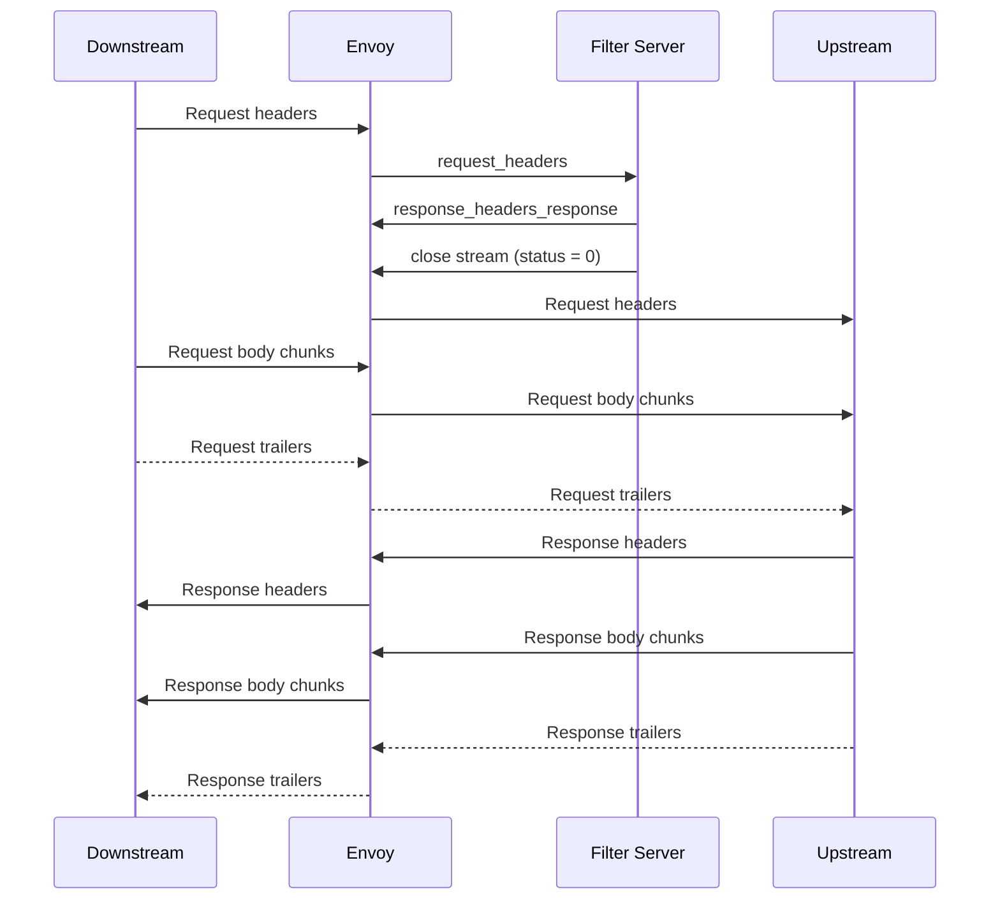

# Design for Supporting External Processing In Contour

Status: Draft

## Abstract

This document describes a design for performing external processing for virtual hosts hosted by Contour.

## Background

For a long time, the community has been advocating for the inclusion of custom HTTP message processing in Contour, leveraging technologies such as `Lua`, `WebAssembly`, `Go`, or `ExtProc`. However, finding a suitable solution that addresses the potential [NACK][2] issues has proven to be challenging, leaving this feature unresolved. Fortunately, after thorough exploration and with the release of Envoy v1.27, the community has ultimately reached a solution utilizing [ExtProc][9]. For further information, please refer to the following links:

- [#1015][1] Enable Lua filter
- [#1176][2] internal/grpc: properly handle Envoy ACK/NACK protocol
- [#2385][3] Add proxy WASM support
- [#2475][4] Need Envoy http filter in contour
- [#3006][5] Support for Envoy Filters (Particularly Lua)
- [#4276][6] Exploration: WASM in Contour
- [#5038][7] Support for External Processing Filter
- [#5123][8] [Feature Discussion] The ways to extend/custom functionalities for Envoy: WASM vs. Lua vs. External Processing vs. GO filter.

## Goals

- Stick to positioning as an escape hatch.
- Support Envoy's L7 External Processing filter for HTTP(s) Virtual Hosts.
- Allow operators to integrate existing custom HTTP message processing service with Contour.
- Decouple Contour from external processing, so it can evolve at an independent rate.
- Integrate cleanly with the HTTPProxy API.
- Supporting set **at most one** External Processing Service for HTTP(s) endpoints.
- Supporting set **at most one** the Global External Processing Service for Virtual Hosts.

## Non Goals

- Abstracting the Envoy external HTTP message processing mechanism.
  The scope of abstracting the Envoy external processing mechanism is too large to be tractable.
  Abstracting the protocol would also work against the goal of being able to integrate existing HTTP message processing servers.

## High-Level Design

Contour will add HTTP support for Envoy's External Processing.

new type: `ExternalProcessor` and its friends: `ExtProc`, `ExtProcOverride`, `ProcessingMode`, `HeaderMutationRules`,`GRPCService`, `ExtProcPolicy` and more, will be defined for implement the design.

In this design, the configuration is divided into three levels: `Global`, `VirtualHost`, `Route`, each level can be set up to one External processing; each level has a `disabled` option, but at different levels, it has different meanings.

If the external processing is added to the filter chain(s), it will be inserted just before the `Router` filter.

### Global level

At the `Global` level, there is at most one external processing configured, and if the `globalExtProc` is NOT nil, and the `processor` is set but `disabled == false`, then it will be append to the filter chain for HTTP and the default chain for HTTPS if this VirtualHost has enabled the fallback certificate; but for the normal HTTPS it varies depending on the configuration at the `VirtualHost` level(see below). If `disabled == true`, it will be ignored.

```yaml
kind: ContourConfiguration
...
  globalExtProc:
    disabled: false  # ignore processor, if it's true
    processor:
      grpcService:
        extensionRef:
          apiVersion: projectcontour.io/v1alpha1
          name: extproc-extsvc
          namespace: extproc-test
        failOpen: true
        responseTimeout: 60s
      mutationRules:
        allowAllRouting: true
      processingMode:
        requestBodyMode: NONE
        requestHeaderMode: SEND
        requestTrailerMode: SKIP
        responseBodyMode: NONE
        responseHeaderMode: SEND
        responseTrailerMode: SKIP
...
```

### VirtualHost level

Only available at HTTPS,for the FQDN.

#### Global Level Set and not disabled

- ##### extProc == nil

  use the `Global` external processing.

- ##### extProc != nil

  - disabled == true

    - The `processor` is NOT set: the `Global` external processing will be disabled.

    - The `processor` is set:  both the `Global` and `VirtualHost` external processing will be disabled.

  - disabled == false

    - The `processor` is NOT set: use the `Global` external processing.

    - The `processor` is set: use the `VirtualHost` external processing.

```yaml
kind: HTTPProxy
...
spec:
  virtualhost:
    extProc:
      disabled: true  # both the `Global` and `VirtualHost` will be disabled
      processor:
        grpcService:
          extensionRef:
            apiVersion: projectcontour.io/v1alpha1
            name: extproc-extsvc2
          namespace: extproc-test
          failOpen: true
          responseTimeout: 60s
        mutationRules:
          allowAllRouting: false
        processingMode:
          requestBodyMode: NONE
          requestHeaderMode: SEND
          requestTrailerMode: SKIP
          responseBodyMode: NONE
          responseHeaderMode: SEND
          responseTrailerMode: SKIP
...
```

##### Route level

For more precise control, the `Global/VirtualHost` external processing can also be **overrideed/toggled** on an individual route.


- ##### extProcPolicy == nil

  use the `Global` or `VirtualHost` external processing.

- ##### extProcPolicy != nil

  - disabled == true

    - The `overrides` is NOT set: the `Global` or `VirtualHost` external processing will be disabled.

    - The `overrides` is set:  the  `Global` or `VirtualHost` or `Route` external processing will be disabled.

  - disabled == false

    - The `overrides` is NOT set: the `Global` or `VirtualHost` external processing will be disabled.

    - The `overrides` is set:  the `Global` or `VirtualHost` or `Route` external processing will be disabled.

```yaml
kind: HTTPProxy
...
spec:
  routes:
    - conditions:
        - prefix: /disabled
      extProcPolicy:  # disabled
        disabled: true
      services:
        - name: http-echo-service
          port: 5678
    - conditions:   # overridden
        - prefix: /override
      extProcPolicy:
        disabled: false
        overrides:
          grpcService:
            extensionRef:
              apiVersion: projectcontour.io/v1alpha1
              name: extproc-extsvc3
              namespace: extproc-test
            failOpen: true
            responseTimeout: 31s
          processingMode:
            requestBodyMode: NONE
            requestHeaderMode: SKIP
            requestTrailerMode: SKIP
            responseBodyMode: NONE
            responseHeaderMode: SEND
            responseTrailerMode: SKIP
      services:
        - name: http-echo-service2
          port: 5678
    - conditions:
        - prefix: /inherit     # use `global` or `virtualhost`
      services:
        - name: http-echo-service3
          port: 5678
...

```


## Detailed Design

### HTTPProxy Newly Added Types:

```go

// HeaderSendMode control how headers and trailers are handled.
type HeaderSendMode string

const (
	// The default HeaderSendMode depends on which part of the message is being
	// processed. By default, request and response headers are sent,
	// while trailers are skipped.
	ProcessingModeDefault HeaderSendMode = "DEFAULT"

	// Send the header or trailer.
	ProcessingModeSend HeaderSendMode = "SEND"

	// Do not send the header or trailer.
	ProcessingModeSkip HeaderSendMode = "SKIP"
)

// BodySendMode control how the request and response bodies are handled
type BodySendMode string

const (
	// Do not send the body at all. This is the default.
	ProcessingModeNone BodySendMode = "NONE"

	// Stream the body to the server in pieces as they arrive at the
	// proxy.
	ProcessingModeStreamed BodySendMode = "STREAMED"

	// Buffer the message body in memory and send the entire body at once.
	// If the body exceeds the configured buffer limit, then the
	// downstream system will receive an error.
	ProcessingModeBuffered BodySendMode = "BUFFERED"

	// Buffer the message body in memory and send the entire body in one
	// chunk. If the body exceeds the configured buffer limit, then the body contents
	// up to the buffer limit will be sent.
	ProcessingModeBufferedPartial BodySendMode = "BUFFERED_PARTIAL"
)

// HeaderMutationRules specifies what headers may be manipulated by a processing filter.
// This set of rules makes it possible to control which modifications a filter may make.
type HeaderMutationRules struct {
	// By default, certain headers that could affect processing of subsequent
	// filters or request routing cannot be modified. These headers are
	// ``host``, ``:authority``, ``:scheme``, and ``:method``.
	// Setting this parameter to true allows these headers to be modified as well.
	//
	// +optional
	AllowAllRouting bool `json:"allowAllRouting,omitempty"`

	// If true, allow modification of envoy internal headers. By default, these
	// start with ``x-envoy`` but this may be overridden in the ``Bootstrap`` configuration.
	// Default is false.
	//
	// +optional
	AllowEnvoy bool `json:"allowEnvoy,omitempty"`

	// If true, prevent modification of any system header, defined as a header
	// that starts with a ``:`` character, regardless of any other settings.
	// A processing server may still override the ``:status`` of an HTTP response
	// using an ``ImmediateResponse`` message.
	// Default is false.
	//
	// +optional
	DisallowSystem bool `json:"disallowSystem,omitempty"`

	// If true, prevent modifications of all header values, regardless of any
	// other settings. A processing server may still override the ``:status``
	// of an HTTP response using an ``ImmediateResponse`` message.
	// Default is false.
	//
	// +optional
	DisallowAll bool `json:"disallowAll,omitempty"`

	// If true, and if the rules in this list cause a header mutation to be
	// disallowed, then the filter using this configuration will terminate the
	// request with a 500 error. In addition, regardless of the setting of this
	// parameter, any attempt to set, add, or modify a disallowed header will
	// cause the ``rejected_header_mutations`` counter to be incremented.
	// Default is false.
	//
	// +optional
	DisallowIsError bool `json:"disallowIsError,omitempty"`
}

// ProcessingMode describes which parts of an HTTP request and response are sent to a remote server
// and how they are delivered.
type ProcessingMode struct {
	// How to handle the request header.
	// Default is "SEND".
	//
	// +kubebuilder:validation:Enum=DEFAULT;SEND;SKIP
	// +kubebuilder:default=SEND
	// +optional
	RequestHeaderMode HeaderSendMode `json:"requestHeaderMode,omitempty"`

	// How to handle the response header.
	// Default is "SEND".
	//
	// +kubebuilder:validation:Enum=DEFAULT;SEND;SKIP
	// +kubebuilder:default=SEND
	// +optional
	ResponseHeaderMode HeaderSendMode `json:"responseHeaderMode,omitempty"`

	// How to handle the request body.
	// Default is "NONE".
	//
	// +kubebuilder:validation:Enum=NONE;STREAMED;BUFFERED;BUFFERED_PARTIAL
	// +kubebuilder:default=NONE
	// +optional
	RequestBodyMode BodySendMode `json:"requestBodyMode,omitempty"`

	// How do handle the response body.
	// Default is "NONE".
	//
	// +kubebuilder:validation:Enum=NONE;STREAMED;BUFFERED;BUFFERED_PARTIAL
	// +kubebuilder:default=NONE
	// +optional
	ResponseBodyMode BodySendMode `json:"responseBodyMode,omitempty"`

	// How to handle the request trailers.
	// Default is "SKIP".
	//
	// +kubebuilder:validation:Enum=DEFAULT;SEND;SKIP
	// +kubebuilder:default=SKIP
	// +optional
	RequestTrailerMode HeaderSendMode `json:"requestTrailerMode,omitempty"`

	// How to handle the response trailers.
	// Default is "SKIP".
	//
	// +kubebuilder:validation:Enum=DEFAULT;SEND;SKIP
	// +kubebuilder:default=SKIP
	// +optional
	ResponseTrailerMode HeaderSendMode `json:"responseTrailerMode,omitempty"`
}

// GRPCService configure the gRPC service that the filter will communicate with.
type GRPCService struct {
	// ExtensionServiceRef specifies the extension resource that will handle the client requests.
	//
	// +optional
	ExtensionServiceRef ExtensionServiceReference `json:"extensionRef,omitempty"`

	// ResponseTimeout sets how long the proxy should wait for responses.
	// Timeout durations are expressed in the Go [Duration format](https://godoc.org/time#ParseDuration).
	// Valid time units are "ns", "us" (or "µs"), "ms", "s", "m", "h".
	// The string "infinity" is also a valid input and specifies no timeout.
	//
	// +optional
	// +kubebuilder:validation:Pattern=`^(((\d*(\.\d*)?h)|(\d*(\.\d*)?m)|(\d*(\.\d*)?s)|(\d*(\.\d*)?ms)|(\d*(\.\d*)?us)|(\d*(\.\d*)?µs)|(\d*(\.\d*)?ns))+|infinity|infinite)$`
	ResponseTimeout string `json:"responseTimeout,omitempty"`

	// If FailOpen is true, the client request is forwarded to the upstream service
	// even if the server fails to respond. This field should not be
	// set in most cases.
	//
	// +optional
	FailOpen bool `json:"failOpen,omitempty"`
}


// ExtProc defines the envoy External Processing filter which allows an external service to act on HTTP traffic in a flexible way
// The external server must implement the v3 Envoy external processing GRPC protocol
// (https://www.envoyproxy.io/docs/envoy/v1.27.0/api-v3/extensions/filters/http/ext_proc/v3/ext_proc.proto).
type ExtProc struct {
	// GRPCService configure the gRPC service that the filter will communicate with.
	//
	// +optional
	GRPCService *GRPCService `json:"grpcService,omitempty"`

	// ProcessingMode describes which parts of an HTTP request and response are sent to a remote server
	// and how they are delivered.
	//
	// +optional
	ProcessingMode *ProcessingMode `json:"processingMode,omitempty"`

	// MutationRules specifies what headers may be manipulated by a processing filter.
	// This set of rules makes it possible to control which modifications a filter may make.
	//
	// for Overrides is must be nil
	//
	// +optional
	MutationRules *HeaderMutationRules `json:"mutationRules,omitempty"`

	// If true, the filter config processingMode can be overridden by the response message from the external processing server `mode_override``.
	// If false, `mode_override` API in the response message will be ignored.
	//
	// +optional
	AllowModeOverride bool `json:"allowModeOverride,omitempty"`
}

// ExternalProcessor defines a external processing filter and the policy for fine-grained at VirutalHost and/or Route level.
type ExternalProcessor struct {
	// Processor defines a external processing filter which allows an external service to act on HTTP traffic in a flexible way.
	//
	// +optional
	Processor *ExtProc `json:"processor,omitempty"`

	// When true, this field disables the external processor: (neither global nor virtualHost)
	// for the scope of the policy.
	//
	// if both Disabled and Processor are set. use disabled.
	//
	// +optional
	Disabled bool `json:"disabled,omitempty"`
}

// ExtProcPolicy modifies how requests/responses are operated.
type ExtProcPolicy struct {
	// When true, this field disables the specific client request external processor
	// for the scope of the policy.
	//
	// if both disabled and overrides are set. use disabled.
	//
	// +optional
	Disabled bool `json:"disabled,omitempty"`

	// Overrides aspects of the configuration for this route.
	//
	// +optional
	Overrides *ExtProc `json:"overrides,omitempty"`
}


```

### HTTPProxy Changes

```Go
// VirtualHost appears at most once. If it is present, the object is considered
// to be a "root".
type VirtualHost struct {
  ...
	// ExtProc which allow to act on HTTP traffic in a flexible way
	// and the policy for fine-grained at VirtualHost level.
	//
	// +optional
	ExtProc *ExternalProcessor `json:"extProc,omitempty"`

}

// Route contains the set of routes for a virtual host.
type Route struct {
  ...
    // ExtProcPolicy updates the external processing policy that were set
	// on the root HTTPProxy object for client requests/responses
	//
	// +optional
	ExtProcPolicy *ExtProcPolicy `json:"extProcPolicy,omitempty"`

}
```

### Contour Configuration changes

An external processing service can be configured in the Contour config file.
This External processing configuration will be used for all HTTP & HTTPS(if not override at VirtualHost and/or Route Level) routes.

```go

// The External Processing filter allows an external service to act on HTTP traffic in a flexible way
// The external server must implement the v3 Envoy
// external processing GRPC protocol (https://www.envoyproxy.io/docs/envoy/v1.27.0/api-v3/extensions/filters/http/ext_proc/v3/ext_proc.proto).
type ExternalProcessor struct {
	// ExtensionService identifies the extension service defining the RLS,
	// formatted as <namespace>/<name>.
	ExtensionService string `yaml:"extensionService,omitempty"`

	// ResponseTimeout configures maximum time to wait for a check response from the expProc server.
	// Timeout durations are expressed in the Go [Duration format](https://godoc.org/time#ParseDuration).
	// Valid time units are "ns", "us" (or "µs"), "ms", "s", "m", "h".
	// The string "infinity" is also a valid input and specifies no timeout.
	//
	// +optional
	ResponseTimeout string `yaml:"responseTimeout,omitempty"`

	// If FailOpen is true, the client request is forwarded to the upstream service
	// even if the authorization server fails to respond. This field should not be
	// set in most cases. It is intended for use only while migrating applications
	// from internal authorization to Contour external authorization.
	//
	// +optional
	FailOpen bool `yaml:"failOpen,omitempty"`
}

// The External Processing filter allows an external service to act on HTTP traffic in a flexible way
// The external server must implement the v3 Envoy
// external processing GRPC protocol (https://www.envoyproxy.io/docs/envoy/v1.27.0/api-v3/extensions/filters/http/ext_proc/v3/ext_proc.proto).
type GlobalExternalProcessor struct {
	// Processor configures the global external processing
	//
	// +optional
	Processor *ExternalProcessor `yaml:"processor,omitempty"`

	// If Disabled is true, no external processing will be append to the filter chain.
	//
	// +optional
	Disabled bool `yaml:"disabled,omitempty"`
}


type Parameters struct {
  ...
	// GlobalExtProc optionally holds properties of the global external processing configurations.
	GlobalExtProc *GlobalExternalProcessor `yaml:"globalExtProc,omitempty"`
  ...
}

type ContourConfigurationSpec struct {
  ...
	// GlobalExtProc allows envoys external processing filter
	// to be enabled for all virtual hosts.
	//
	// +optional
	GlobalExtProc *contour_v1.ExternalProcessor `json:"globalExtProc,omitempty"`
  ...
}
```

An operator configures external processing on a root `HTTPProxy` by setting the `VirtualHost.ExtProc` field.
Setting this field without also setting the `TLS` field is an error.

### Progressing Flow

This chart (copy/change from [External Processing Filter][10]) shows the simplest possible implementation of the filter -- a filter server receives the HTTP request headers, decides to accept the response (and can optionally modify the headers) so it closes the stream cleanly. At this point it is no longer involved in filter processing. see [External Processing Filter][10] for more information.



### Sample configurations

Please refer to `examples/external-processing`.

With this proposal, contour will generate the envoy configuration snippet below for `examples/external-processing`. 
NOTE: this snippet only represents the relevant bits of the Route.

##### Envoy

```yaml
{
  ...
     "dynamic_route_configs": [
          {
               "route_config": {
                    "@type": "type.googleapis.com/envoy.config.route.v3.RouteConfiguration",
                    "name": "https/https.projectcontour.io",
                    "virtual_hosts": [
                         {
                              "domains": [
                                   "https.projectcontour.io"
                              ],
                              "name": "https.projectcontour.io",
                              "routes": [
                                   {
                                        "match": {
                                             "prefix": "/disabled"
                                        },
                                        "route": {
                                             "cluster": "extproc-test/http-echo-service/5678/da39a3ee5e"
                                        },
                                        "typed_per_filter_config": {
                                             "envoy.filters.http.ext_proc": {
                                                  "@type": "type.googleapis.com/envoy.extensions.filters.http.ext_proc.v3.ExtProcPerRoute",
                                                  "disabled": true
                                             }
                                        }
                                   },
                                   {
                                        "match": {
                                             "prefix": "/override"
                                        },
                                        "route": {
                                             "cluster": "extproc-test/http-echo-service3/5678/da39a3ee5e"
                                        },
                                        "typed_per_filter_config": {
                                             "envoy.filters.http.ext_proc": {
                                                  "@type": "type.googleapis.com/envoy.extensions.filters.http.ext_proc.v3.ExtProcPerRoute",
                                                  "overrides": {
                                                       "grpc_service": {
                                                            "envoy_grpc": {
                                                                 "authority": "extension.extproc-test.extproc-extsvc3",
                                                                 "cluster_name": "extension/extproc-test/extproc-extsvc3"
                                                            },
                                                            "timeout": "30s"
                                                       },
                                                       "processing_mode": {
                                                            "request_header_mode": "SEND",
                                                            "request_trailer_mode": "SKIP",
                                                            "response_header_mode": "SEND",
                                                            "response_trailer_mode": "SKIP"
                                                       }
                                                  }
                                             }
                                        }
                                   },
                                   {
                                        "match": {
                                             "prefix": "/inherit"
                                        },
                                        "route": {
                                             "cluster": "extproc-test/http-echo-service2/5678/da39a3ee5e"
                                        }
                                   }
                              ]
                         }
                    ]
               },
               "version_info": "7"
          },
     ]
  ...
}
```

## Alternatives Considered
_TBD_

# Metrics
_TBD_

## Security Considerations

- HTTPS sessions between Envoy and the processing server are required.
  TLS validation can be configured if necessary (should be recommended),
- Processing services can run in separate Kubernetes namespaces with limited privilege.

## Compatibility

HTTPProxy will opt-out to use the default global external processing explicitly and the `GlobalExtProc` in the Contour configuration is optional. This solution should not introduce any regressions or breaking changes.

[1]: https://github.com/projectcontour/contour/issues/1015
[2]: https://github.com/projectcontour/contour/issues/1176
[3]: https://github.com/projectcontour/contour/issues/2385
[4]: https://github.com/projectcontour/contour/issues/2475
[5]: https://github.com/projectcontour/contour/issues/3006
[6]: https://github.com/projectcontour/contour/issues/4276
[7]: https://github.com/projectcontour/contour/issues/5038
[8]: https://github.com/projectcontour/contour/issues/5123
[9]: https://www.envoyproxy.io/docs/envoy/latest/api-v3/extensions/filters/http/ext_proc/v3/ext_proc.proto
[10]: https://docs.google.com/document/d/1IZqm5IUnG9gc2VqwGaN5C2TZAD9_QbsY9Vvy5vr9Zmw/edit#heading=h.5irk4csrpu0y
