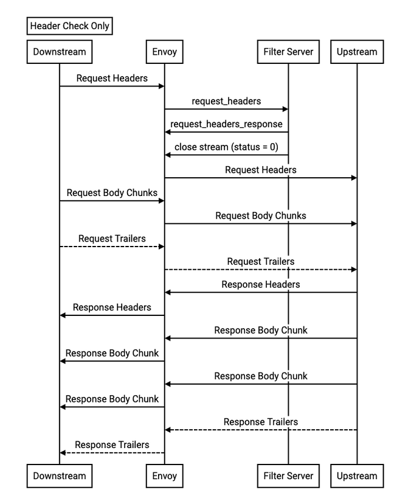

# Design for Supporting External Processing In Contour

Status: Draft

## Abstract

This document describes a design for performing external processing for virtual hosts hosted by Contour.

## Background

For a long time, the community has been advocating for the inclusion of custom HTTP message processing in Contour, leveraging technologies such as `Lua`, `WebAssembly`, `Go`, or `ExtProc`. However, finding a suitable solution that addresses the potential [NACK][2] issues has proven to be challenging, leaving this feature unresolved. Fortunately, after thorough exploration and with the release of Envoy v1.27, the community has ultimately reached a solution utilizing [ExtProc][9]. For further information, please refer to the following links:

- [#1015][1] Enable Lua filter
- [#1176][2] internal/grpc: properly handle Envoy ACK/NACK protocol
- [#2385][3] Add proxy WASM support
- [#2475][4] Need Envoy http filter in contour
- [#3006][5] Support for Envoy Filters (Particularly Lua)
- [#4276][6] Exploration: WASM in Contour
- [#5038][7] Support for External Processing Filter
- [#5123][8] [Feature Discussion] The ways to extend/custom functionalities for Envoy: WASM vs. Lua vs. External Processing vs. GO filter.


## Goals

- Support Envoy's L7 External Processing filter for HTTP Virtual Hosts.
- Allow operators to integrate existing custom HTTP message processing service(s) with Contour.
- Decouple Contour from external processing, so it can evolve at an independent rate.
- Integrate cleanly with the HTTPProxy API.
- Supporting >=1 External Processing Services for HTTP endpoints.
- Supporting set the Global External Processing Service(s) for Virtual Hosts.
- Supporting add External processing Service(s) at different processing phases.

## Non Goals

- Abstracting the Envoy external HTTP message processing mechanism.
  The scope of abstracting the Envoy external processing mechanism is too large to be tractable.
  Abstracting the protocol would also work against the goal of being able to integrate existing HTTP message processing servers.


## High-Level Design

Contour will add HTTP support for Envoy's External Processing.


new type: `ExternalProcessor` and its friends: `ExtProc`, `ExtProcOverride`, `ProcessingMode`, `HeaderMutationRules`,`GRPCService`, `ProcessingPhase`,`ExtProcPolicy`, will be defined for implement the design.

A `globalExtProc` config would define a global external processing configuration for all hosts and routes.

```yaml
apiVersion: projectcontour.io/v1alpha1
kind: ContourConfiguration
...
spec:
  globalExtProc:
    processors:
      - grpcService:
          extensionRef:
            apiVersion: projectcontour.io/v1alpha1
            name: extproc-extsvc
            namespace: extproc-test
          failOpen: false
          responseTimeout: 30s
        processingMode:
          requestBodyMode: 0
          requestHeaderMode: 1
          requestTrailerMode: 2
          responseBodyMode: 0
          responseHeaderMode: 1
          responseTrailerMode: 2
      - grpcService:
          extensionRef:
            apiVersion: projectcontour.io/v1alpha1
            name: extproc-extsvc2
            namespace: extproc-test
          failOpen: true
          responseTimeout: 60s
        processingMode:
          requestBodyMode: 0
          requestHeaderMode: 1
          requestTrailerMode: 2
          responseBodyMode: 0
          responseHeaderMode: 1
          responseTrailerMode: 2
...
```
### Opting out from Global/VirtualHost External Processing

By default, enabling `Global` external processing would allow custom HTTP message processing on all virtual hosts. On the other hand, if processing is done at the `virtualHost` level, custom HTTP message processing would only be enabled for the specific virtual host in question. However, individual owners of HTTPProxy will have the flexibility to modify or override this setting.

#### Override/Disabling External Processing

##### Virtual Host level

`Override(Only for HTTPS)/Disable` the global external processing on the virtual host. This setting would **override/disable** all routes on said virtual host.

```yaml
kind: HTTPProxy
...
spec:
  virtualhost:
    extProc:
      extProcPolicy:
        disabled: false  # true: for disable
      processors:
        - grpcService:
            extensionRef:
              apiVersion: projectcontour.io/v1alpha1
              name: extproc-extsvc3
              namespace: extproc-test
            failOpen: true
            responseTimeout: 60s
          processingMode:
            requestBodyMode: 0
            requestHeaderMode: 1
            requestTrailerMode: 2
            responseBodyMode: 0
            responseHeaderMode: 1
            responseTrailerMode: 2
...
```

##### Route level

For more precise control, the `Global` and/or `VirtualHost` external processing can also be **overrideed/toggled** on an individual route. the priority is as follows: `Global` < `VirtualHost` < `Route`


```yaml
kind: HTTPProxy
...
spec:
  routes:
    - conditions:
        - prefix: /disabled
      extProcPolicy:
        disabled: true  # diabled for /disabled
      services:
        - name: http-echo-service
          port: 5678
    - conditions:
        - prefix: /override
      extProcPolicy:
        overrides:      # override for /override
          grpcService:
            extensionRef:
              apiVersion: projectcontour.io/v1alpha1
              name: extproc-extsvc4
              namespace: extproc-test
            failOpen: true
            responseTimeout: 60s
          processingMode:
            requestBodyMode: 0
            requestHeaderMode: 1
            requestTrailerMode: 2
            responseBodyMode: 0
            responseHeaderMode: 1
            responseTrailerMode: 2
      services:
        - name: http-echo-service2
          port: 5678
    - conditions:
        - prefix: /noop     # noop
      services:
        - name: http-echo-service3
          port: 5678
...

```


## Detailed Design

### HTTPProxy Newly Added Types:

```go

// HeaderSendMode control how headers and trailers are handled
type HeaderSendMode int32

const (
	// The default HeaderSendMode depends on which part of the message is being
	// processed. By default, request and response headers are sent,
	// while trailers are skipped.
	ProcessingMode_DEFAULT HeaderSendMode = 0

	// Send the header or trailer.
	ProcessingMode_SEND HeaderSendMode = 1

	// Do not send the header or trailer.
	ProcessingMode_SKIP HeaderSendMode = 2
)

// BodySendMode control how the request and response bodies are handled
type BodySendMode int32

const (
	// Do not send the body at all. This is the default.
	ProcessingMode_NONE BodySendMode = 0

	// Stream the body to the server in pieces as they arrive at the
	// proxy.
	ProcessingMode_STREAMED BodySendMode = 1

	// Buffer the message body in memory and send the entire body at once.
	// If the body exceeds the configured buffer limit, then the
	// downstream system will receive an error.
	ProcessingMode_BUFFERED BodySendMode = 2

	// Buffer the message body in memory and send the entire body in one
	// chunk. If the body exceeds the configured buffer limit, then the body contents
	// up to the buffer limit will be sent.
	ProcessingMode_BUFFERED_PARTIAL BodySendMode = 3
)

// HeaderMutationRules specifies what headers may be manipulated by a processing filter.
// This set of rules makes it possible to control which modifications a filter may make.
type HeaderMutationRules struct {
	// By default, certain headers that could affect processing of subsequent
	// filters or request routing cannot be modified. These headers are
	// ``host``, ``:authority``, ``:scheme``, and ``:method``. Setting this parameter
	// to true allows these headers to be modified as well.
	//
	// +optional
	AllowAllRouting bool `json:"allowAllRouting,omitempty"`

	// If true, allow modification of envoy internal headers. By default, these
	// start with ``x-envoy`` but this may be overridden in the ``Bootstrap``
	// configuration. Default is false.
	//
	// +optional
	AllowEnvoy bool `json:"allowEnvoy,omitempty"`

	// If true, prevent modification of any system header, defined as a header
	// that starts with a ``:`` character, regardless of any other settings.
	// A processing server may still override the ``:status`` of an HTTP response
	// using an ``ImmediateResponse`` message. Default is false.
	//
	// +optional
	DisallowSystem bool `json:"disallowSystem,omitempty"`

	// If true, prevent modifications of all header values, regardless of any
	// other settings. A processing server may still override the ``:status``
	// of an HTTP response using an ``ImmediateResponse`` message. Default is false.
	//
	// +optional
	DisallowAll bool `json:"disallowAll,omitempty"`

	// If true, and if the rules in this list cause a header mutation to be
	// disallowed, then the filter using this configuration will terminate the
	// request with a 500 error. In addition, regardless of the setting of this
	// parameter, any attempt to set, add, or modify a disallowed header will
	// cause the ``rejected_header_mutations`` counter to be incremented.
	// Default is false.
	//
	// +optional
	DisallowIsError bool `json:"disallowIsError,omitempty"`
}

// ProcessingMode describes which parts of an HTTP request and response are sent to a remote server
// and how they are delivered.
type ProcessingMode struct {
	// How to handle the request header. Default is "SEND".
	//
	// +optional
	RequestHeaderMode HeaderSendMode `json:"requestHeaderMode,omitempty"`

	// How to handle the response header. Default is "SEND".
	//
	// +optional
	ResponseHeaderMode HeaderSendMode `json:"responseHeaderMode,omitempty"`

	// How to handle the request body. Default is "NONE".
	//
	// +optional
	RequestBodyMode BodySendMode `json:"requestBodyMode,omitempty"`

	// How do handle the response body. Default is "NONE".
	//
	// +optional
	ResponseBodyMode BodySendMode `json:"responseBodyMode,omitempty"`

	// How to handle the request trailers. Default is "SKIP".
	//
	// +optional
	RequestTrailerMode HeaderSendMode `json:"requestTrailerMode,omitempty"`

	// How to handle the response trailers. Default is "SKIP".
	//
	// +optional
	ResponseTrailerMode HeaderSendMode `json:"responseTrailerMode,omitempty"`
}

// GRPCService configure the gRPC service that the filter will communicate with.
type GRPCService struct {
	// ExtensionServiceRef specifies the extension resource that will handle the client requests.
	//
	// +optional
	ExtensionServiceRef ExtensionServiceReference `json:"extensionRef,omitempty"`

	// ResponseTimeout sets how long the proxy should wait for responses.
	// Timeout durations are expressed in the Go [Duration format](https://godoc.org/time#ParseDuration).
	// Valid time units are "ns", "us" (or "µs"), "ms", "s", "m", "h".
	// The string "infinity" is also a valid input and specifies no timeout.
	//
	// +optional
	// +kubebuilder:validation:Pattern=`^(((\d*(\.\d*)?h)|(\d*(\.\d*)?m)|(\d*(\.\d*)?s)|(\d*(\.\d*)?ms)|(\d*(\.\d*)?us)|(\d*(\.\d*)?µs)|(\d*(\.\d*)?ns))+|infinity|infinite)$`
	ResponseTimeout string `json:"responseTimeout,omitempty"`

	// If FailOpen is true, the client request is forwarded to the upstream service
	// even if the server fails to respond. This field should not be
	// set in most cases.
	//
	// +optional
	FailOpen bool `json:"failOpen,omitempty"`
}

// ProcessingPhase define the phase in the filter chain where the external processing filter will be injected
type ProcessingPhase string

const (
	// UnspecifiedPhase decides where to insert the external processing service.
	// This will generally be at the end of the filter chain, right before the Router
	UnspecifiedPhase ProcessingPhase = "UnspecifiedPhase"

	// Insert before contour authentication filter(s).
	AuthN ProcessingPhase = "AuthN"

	// Insert  before contour authorization filter(s) and after the authentication filter(s).
	AuthZ ProcessingPhase = "AuthZ"

	// Insert  before contour CORS filter(s).
	CORS ProcessingPhase = "CORS"

	// Insert  before contour RateLimit.
	RateLimit ProcessingPhase = "RateLimit"
)

// ExtProc defines the envoy External Processing filter which allows an external service to act on HTTP traffic in a flexible way
// The external server must implement the v3 Envoy external processing GRPC protocol
// (https://www.envoyproxy.io/docs/envoy/v1.27.0/api-v3/extensions/filters/http/ext_proc/v3/ext_proc.proto).
type ExtProc struct {
	// Phase determines where in the filter chain this extProc is to be injected.
	//
	// +optional
	Phase ProcessingPhase `json:"phase,omitempty"`

	// Priority determines ordering of processing filters in the same phase. When multiple extProc are applied to the same workload in the same phase,
	// they will be applied by priority, in descending order, If priority is not set or two extProc exist with the same value,
	// they will follow the order in which extProc(s) are added, Defaults to 0.
	//
	// +optional
	Priority int32 `json:"priority,omitempty"`

	// GRPCService configure the gRPC service that the filter will communicate with.
	//
	// +optional
	GRPCService *GRPCService `json:"grpcService,omitempty"`

	// ProcessingMode describes which parts of an HTTP request and response are sent to a remote server
	// and how they are delivered.
	//
	// +optional
	ProcessingMode *ProcessingMode `json:"processingMode,omitempty"`

	// MutationRules specifies what headers may be manipulated by a processing filter.
	// This set of rules makes it possible to control which modifications a filter may make.
	//
	// +optional
	MutationRules *HeaderMutationRules `json:"mutationRules,omitempty"`
}

// ExtProcOverride override aspects of the configuration for this route.
// A set of overrides in a more specific configuration will override a “disabled” flag set in a less-specific one.
type ExtProcOverride struct {
	// GRPCService configure the gRPC service that the filter will communicate with.
	//
	// +optional
	GRPCService *GRPCService `json:"grpcService,omitempty"`

	// ProcessingMode describes which parts of an HTTP request and response are sent to a remote server
	// and how they are delivered.
	//
	// +optional
	ProcessingMode *ProcessingMode `json:"processingMode,omitempty"`
}

// ExternalProcessor defines a processing filter list and the policy for fine-grained at VirutalHost and/or Route level.
type ExternalProcessor struct {
	// Processors defines a processing filter list,and each filter in the list
	// will be added to the corresponding processing Priority in ascending order of it's Priority within the same phase.
	// If no phase is specified, it will be added before the Router.
	// If no Priority is specified, the filters will be added in the order they appear in the list.
	//
	// +optional
	Processors []ExtProc `json:"processors,omitempty"`

	// ExtProcPolicy sets a external processing policy.
	// This policy will be used unless overridden by individual routes.
	//
	// **Note: for the Global External Processor, it's must be nil.
	//
	// +optional
	ExtProcPolicy *ExtProcPolicy `json:"extProcPolicy,omitempty"`
}

// ExtProcPolicy modifies how requests/responses are operated.
type ExtProcPolicy struct {
	// When true, this field disables client request external processing
	// for the scope of the policy.
	// Precisely one of disabled, overrides must be set.
	//
	// +optional
	Disabled bool `json:"disabled,omitempty"`

	// Overrides aspects of the configuration for this route.
	//
	// **Note: for VirtualHost, it's must be nil.
	//
	// +optional
	Overrides *ExtProcOverride `json:"overrides,omitempty"`
}
```

### HTTPProxy Changes

```Go
// VirtualHost appears at most once. If it is present, the object is considered
// to be a "root".
type VirtualHost struct {
  ...
	// ExternalProcessor contains a list of external processors which allow to act on HTTP traffic in a flexible way
	// and the policy for fine-grained at VirtualHost level.
	//
	// +optional
	ExternalProcessor *ExternalProcessor `json:"extProc,omitempty"`
}

// Route contains the set of routes for a virtual host.
type Route struct {
  ...
	// ExtProcPolicy updates the external processing policy that was set
	// on the root HTTPProxy object for client requests/responses that
	// match this route.
	//
	// +optional
	ExtProcPolicy *ExtProcPolicy `json:"extProcPolicy,omitempty"`
}
```

### Contour Configuration changes

An external processing service can be configured in the Contour config file.
This External processing configuration will be used for all HTTP & HTTPS(if not ovrride at VirtualHost and/or Route Level) routes.

```go
type Parameters struct {
  ...
	// GlobalExternalProcessor optionally holds properties of the global external processing configurations.
	GlobalExternalProcessor *contour_api_v1.ExternalProcessor `yaml:"globalExtProc,omitempty"`
  ...
}

type ContourConfigurationSpec struct {
  ...
	// GlobalExternalProcessor allows envoys external processing filters
	// to be enabled for all virtual hosts.
    //
	// +optional
	GlobalExternalProcessor *contour_api_v1.ExternalProcessor `json:"globalExtProc,omitempty"`
  ...
}
```

An operator configures external processing on a root `HTTPProxy` by setting the `VirtualHost.ExternalProcessor` field.
Setting this field without also setting the `TLS` field is an error.

### Progressing Flow

This chart (copy from [External Processing Filter][10]) shows the simplest possible implementation of the filter -- a filter server receives the HTTP request headers, decides to accept the response (and can optionally modify the headers) so it closes the stream cleanly. At this point it is no longer involved in filter processing. see [External Processing Filter][10] for more information


### Sample configurations

Please refer to examples/external-processing

With this proposal, contour will generate the envoy configuration snippet below. 
NOTE: this snippet only represents the relevant bits of the Route.

##### Envoy

```yaml
{
  ...
     "dynamic_route_configs": [
          {
               "route_config": {
                    "@type": "type.googleapis.com/envoy.config.route.v3.RouteConfiguration",
                    "name": "https/https.projectcontour.io",
                    "virtual_hosts": [
                         {
                              "domains": [
                                   "https.projectcontour.io"
                              ],
                              "name": "https.projectcontour.io",
                              "routes": [
                                   {
                                        "match": {
                                             "prefix": "/disabled"
                                        },
                                        "route": {
                                             "cluster": "extproc-test/http-echo-service/5678/da39a3ee5e"
                                        },
                                        "typed_per_filter_config": {
                                             "envoy.filters.http.ext_proc": {
                                                  "@type": "type.googleapis.com/envoy.extensions.filters.http.ext_proc.v3.ExtProcPerRoute",
                                                  "disabled": true
                                             }
                                        }
                                   },
                                   {
                                        "match": {
                                             "prefix": "/use-route"
                                        },
                                        "route": {
                                             "cluster": "extproc-test/http-echo-service3/5678/da39a3ee5e"
                                        },
                                        "typed_per_filter_config": {
                                             "envoy.filters.http.ext_proc": {
                                                  "@type": "type.googleapis.com/envoy.extensions.filters.http.ext_proc.v3.ExtProcPerRoute",
                                                  "overrides": {
                                                       "grpc_service": {
                                                            "envoy_grpc": {
                                                                 "authority": "extension.extproc-test.extproc-extsvc3",
                                                                 "cluster_name": "extension/extproc-test/extproc-extsvc3"
                                                            },
                                                            "timeout": "30s"
                                                       },
                                                       "processing_mode": {
                                                            "request_header_mode": "SEND",
                                                            "request_trailer_mode": "SKIP",
                                                            "response_header_mode": "SEND",
                                                            "response_trailer_mode": "SKIP"
                                                       }
                                                  }
                                             }
                                        }
                                   },
                                   {
                                        "match": {
                                             "prefix": "/use-vh"
                                        },
                                        "route": {
                                             "cluster": "extproc-test/http-echo-service2/5678/da39a3ee5e"
                                        }
                                   }
                              ]
                         }
                    ]
               },
               "version_info": "7"
          },
          {
               "route_config": {
                    "@type": "type.googleapis.com/envoy.config.route.v3.RouteConfiguration",
                    "name": "ingress_http",
                    "virtual_hosts": [
                         {
                              "domains": [
                                   "http.projectcontour.io"
                              ],
                              "name": "http.projectcontour.io",
                              "routes": [
                                   {
                                        "match": {
                                             "prefix": "/use-default"
                                        },
                                        "route": {
                                             "cluster": "extproc-test/http-echo-service4/5678/da39a3ee5e"
                                        }
                                   }
                              ]
                         }
                    ]
               },
               "version_info": "7"
          }
     ]
  ...
}
```

## Alternatives Considered
_TBD_

# Metrics
_TBD_

## Security Considerations

- HTTPS sessions between Envoy and the processing server are required.
  TLS validation can be configured if necessary (should be recommended),
- Processing services can run in separate Kubernetes namespaces with limited privilege.

## Compatibility

HTTPProxy will opt-out to use the default global external processing explicitly and the `GlobalExtProc` in the Contour configuration is optional. This solution should not introduce any regressions or breaking changes.


[1]: https://github.com/projectcontour/contour/issues/1015
[2]: https://github.com/projectcontour/contour/issues/1176
[3]: https://github.com/projectcontour/contour/issues/2385
[4]: https://github.com/projectcontour/contour/issues/2475
[5]: https://github.com/projectcontour/contour/issues/3006
[6]: https://github.com/projectcontour/contour/issues/4276
[7]: https://github.com/projectcontour/contour/issues/5038
[8]: https://github.com/projectcontour/contour/issues/5123
[9]: https://www.envoyproxy.io/docs/envoy/latest/api-v3/extensions/filters/http/ext_proc/v3/ext_proc.proto
[10]: https://docs.google.com/document/d/1IZqm5IUnG9gc2VqwGaN5C2TZAD9_QbsY9Vvy5vr9Zmw/edit#heading=h.5irk4csrpu0y

