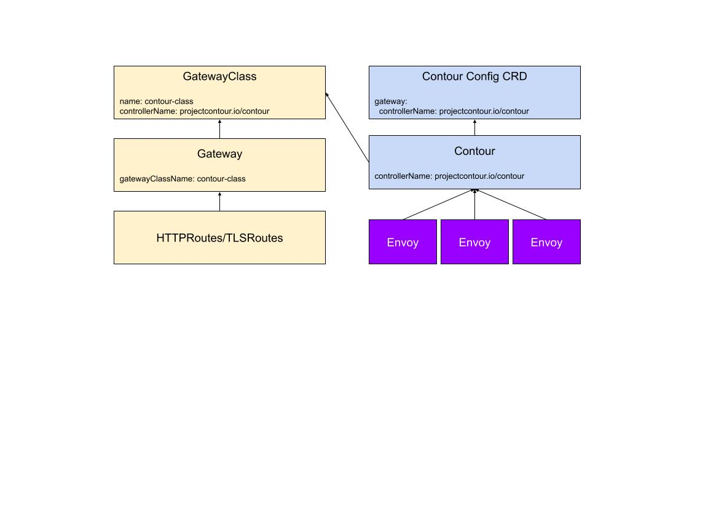
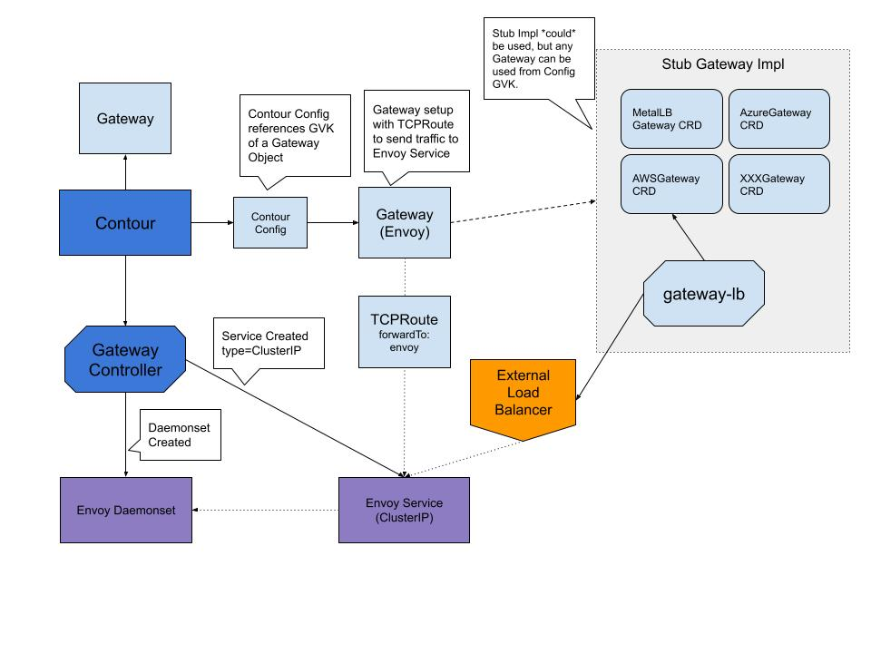

# Contour + Operator + GatewayAPI Design

# Abstract

The Gateway API is the evolution of the Kubernetes APIs that relate to Services, such as Ingress. This document outlines what parts of these APIs Contour will implement, and how it will do so.

# Background

The Gateway API project is a subproject of Kubernetes SIG-Network, and is an attempt to re-do the mechanics around Services and Ingress, and how they interact.
It consists of a number of objects, not just the Gateway object, but that object is the key, so the API as a whole is named after it.
The project is aiming to cover the things currently implemented by Layer 4 load balancers that implement Services of type LoadBalancer, and ingress controllers (like Contour).

The Gateway API targets three personas:

* Infrastructure provider: The infrastructure provider (infra) is responsible for the overall environment that the cluster(s) are operating in. Examples include: the cloud provider (AWS, Azure, GCP, ...), the PaaS provider in a company.
* Cluster operator: The cluster operator (ops) is responsible for administration of entire clusters. They manage policies, network access, application permissions.
* Application developer: The application developer (dev) is responsible for defining their application configuration (e.g. timeouts, request matching/filter) and Service composition (e.g. path routing to backends).

The cluster operator and application developer are basically the same as Contour's Cluster Administrator and Application Developer personas, which will be important for this design.

In terms of the APIs themselves, the Gateway API has 3 primary API resources (taken from the gateway-apis docs site):

* GatewayClass defines a set of gateways with a common configuration and behavior.
* Gateway requests a point where traffic can be translated to Services within the cluster, using an internal Listener construct.
* Routes describe how traffic coming via the Gateway maps to the Services.

In Contour, we've previously solved a lot of the same problems with HTTPProxy (and IngressRoute before it).
That functionality can be described in the Gateway API by HTTPRoutes and TLSRoutes, as they describe Layer 7 ingress, as Contour does today.

Other types of routes include TCPRoutes and UDPRoutes, which are intended for Layer 4 load balancers.
Implementations may also define their own Route objects, at the cost of interoperability.

In terms of its stated goals, Contour is aiming at being an ingress controller - that is, a Layer 7 proxy with some api gateway functions.
Currently, Contour provides "TCP Proxying" that allows the forwarding of TLS streams based on the SNI information, which is precisely what the Gateway API TLSRoute object is for.
If Project Contour (the organisation) does add support for TCP and UDP forwarding, it will not be in the projectcontour/contour repo, but will be a separate repo.

This design is intended to cover the initial alpha releases of the Gateway API. We will aim to implement the core featureset of the APIs at that point.
We will then work with the upstream community on features that Contour and HTTPProxy currently support, but the Gateway API do not, and how best to represent those features in the APIs.
There are some features that are currently gaps for Contour (wildcard domain names, and exact path matching, for example), and some that Contour supports that the Gateway API do not (websockets, configurable timeouts, header replacement, external auth, rate limiting, and so on).

Our eventual ideal is that HTTPProxy and Gateway API will have feature parity. Practically, there may be times when HTTPProxy can move faster than Gateway API because we have a smaller feature surface.
We see this as a chance for HTTPProxy to test out ideas for Gateway API functionality, and provide feedback on what features should be in the core, extension, and implementation-specific parts of the API.

## Goals

* Define a data model and implementation for Contour's Gateway API support, covering the v1alpha1 version of the Gateway API.
* Layer 7 support only, which means HTTPRoutes, TLSRoutes only.

## Non Goals

* No TCPRoute or UDPRoute support, that is, no support for arbitrary TCP/UDP forwarding.

# High-Level Design

## Gateway API implementation surface area

Contour's support for the Gateway API will include support for the HTTPRoute and TLSRoute objects only, not any other type of Route - this includes no TCPRoute or UDPRoute support. Contour is a layer 7 ingress controller, and the layer 4 load balancing implied by TCPRoute and UDPRoute is out of scope for this tool (that is, projectcontour/contour). Project Contour (the organisation) may investigate a Gateway API based layer 4 solution in the future, but that effort will not be in projectcontour/contour.

## Contour Gateway model

Contour considers a Gateway to describe a single Envoy deployment. Contour expects to be supplied with a `ControllerName` which is required to match a `GatewayClass`.
Contour will update the status of both the `Gateway` & `GatewayClass`. When a `ControllerName` is not supplied, Contour will not do Gateway API processing.
Contour will merge Listeners within its Gateway. (See the detailed design for the exact rules Contour will use for this.)

Right now it is expected that one instance of Contour maps to a single fleet of Envoy instances. 
Similarly, one GatewayClass maps to a single Gateway regardless if provisioned manually or via the operator.



## Dynamic Envoy Provisioning

Typically, the fleet of Envoys that connect to Contour to get their configuration information has been managed manually by the cluster operator.
Given a more dynamic configuration API, it's convenient to have the Envoy fleet configuration in Kubernetes be managed by a controller.
This allows cluster operator to simply deploy a Contour deployment, leaving the details about how Envoy is provisioned in the cluster as well as exposed outside of the cluster to a configuration file or CRD.

This behavior is meant to be optional and layered, such that users who want a fully managed environment can deploy the Contour Operator which manages instances of Contour which in turn manages instances of Envoy.
However, other users may not desire that level of controller driven infrastructure.
This design leaves users with their choice of deployment models.

## Interrelated watches

The Gateway API is a set of interrelated Kubernetes objects, where a change in one object can mean that the scope of objects Contour is interested in will change.
Because of this, Contour will watch all events associated with its named GatewayClass, Gateway, HTTPRoute, TLSRoute, and BackendPolicy objects, and filter the objects it takes action on internally.

## Combining Gateway API with other configuration

When it calculates the Envoy configuration using the DAG, Contour layers different types of configuration in order. Currently, Ingress is overwritten by HTTPProxy. 
If an Ingress and a HTTPProxy specify the exact same route, the HTTPProxy will win.

Once we have the Gateway API available as well, the processing order will be Ingress is overwritten by HTTPProxy, and is overwritten by the Gateway API.

## Status management

Each object in the Gateway API set has its own status definition. In general, Contour will update the status of any object that comes into scope with its details, ensuring that the observedGeneration field is set correctly. When objects fall out of scope, any status set by Contour will not be removed. It's expected that things that check the status will also check the observedGeneration to check if the status information is up-to-date with the current object generation.

## Per-object design notes

### GatewayClass

Contour watches for GatewayClass resources. When Contour’s configured controllerName matches a GatewayClass, contour will look for a matching Gateway based upon the GatewayClass.Name field.

If multiple GatewayClasses match the same controllerName, the oldest class based upon creation timestamp is utilized.

### Gateway

Contour watches for the Gateway that belongs to the GatewayClass identified per the rules in the previous section. The `spec.classname` field in the Gateway is used to find a `GatewayClass`. As long as the corresponding GatewayClass matches the `ControllerName` field, Contour will process that Gateway. If multiple Gateways are found matching the same GatewayClass, then the oldest Gateway is processed and additional Gateways will have a status set informing users that the Gateway is not being processed.

Contour is not able to specify the address that the Envoy deployment will listen on, and so will ignore any entries in the Gateway's spec.addresses field.

For Contour, the key Gateway section are the Listeners. These define how an implementation should listen for traffic described by Routes.

For Listeners:

* Listeners inside Gateways will be merged where possible.
* Conflicts within a Gateway will result in the relevant Listeners both being rejected (as there is no way to determine which one was first).
* Listeners are considered mergeable if all the fields out of hostname, port, and protocol match, with some additional rules around TLS.
* Further merging rules are specified in the detailed design below.
* Listeners that refer to any other Route than HTTPRoute or TLSRoute will be ignored, and a condition placed on the corresponding status.listeners[] object saying that it was ignored because those objects are not supported.

The Gateway may supply TLS config, in which case it is used as a default. The TLS config may be overridden by HTTPRoutes if the Gateway spec.listeners[].tls.routeOverride is set to Allow. This allows the Gateway to configure a default TLS certificate. Note that this feature has fiddly interactions with the various places in which a hostname may be specified; this will require careful test case design.

The output of this watcher is both Envoy configuration, as well as an optional set of Kubernetes resources automatically managed.

### HTTPRoute

Contour will watch all HTTPRoute objects, and filter for entries as per the spec.
This is a two level filter, by the configured Gateway's rules about namespaces, and then by the label selector for the Routes themselves.
Configuration of HTTPRoutes will be also subject to the rules around the RouteGateways field, for filtering which Gateways the HTTPRoute is allowed to be referenced by.

When a HTTPRoute specifies a hostname or slice of hostnames, those hostnames must match the hostnames in the Gateway.
Note that more specific precise matches at the Hostname level may match less specific wildcard matches at the Gateway level.
This allows the Gateway to define a default TLS certificate, which may only be overridden.

The HTTPRoute also has a facility to supply additional TLS Config using the tls stanza (the RouteTLSConfig field).
The most important part here is that the field is only used if the AllowRouteOverride field is set in the referencing Gateway resource.

Contour will only ever update the status of HTTPRoute objects.

Errors or conflicts here will render that rule invalid, but not the rest of the rules. Other valid rules will still be passed to Envoy.
For each invalid rule, Contour will update status information with the rule and the reason. A conflict will not result in the whole HTTPRoute being rejected unless there are zero rules left.

The output of this watcher is Envoy configuration.

### TLSRoute

Contour will watch all TLSRoute objects, and filter for entries matching a label selector in its configured Gateway's spec.listeners[].routes, and will configure the associated routes.
Configuration of TLSRoutes will be subject to the rules around the RouteGateways field.

Contour will only ever update the status of TLSRoute objects.

Errors or conflicts here will render that section of the config invalid. Other valid sections will still be passed to Envoy.

The output of this watcher is Envoy configuration.

## Detailed Design

### Responsibilities

#### Contour

In the fully managed mode, Contour is responsible for managing the Envoy fleet which includes the Envoy Kubernetes Daemonset and the Envoy Kubernetes Service.

#### Operator

The operator is responsible for managing instances of Contour as well as any additional configuration items that are related to running Contour or Envoy.
These pieces will be configured in the Contour Configuration CRD.

### Configmap to Contour Configuration CRD

Currently, Contour gets its configuration from two different places, one is the configuration file represented as a Kubernetes configmap.
The other are flags which are passed to Contour.

This design will migrate the Contour configuration configmap to a full custom resource definition which will allow for better validation, easier processing, allow for status to be set, including how Envoy is to be provisioned if the user desires.

#### Benefits

* Eliminates the need to translate from a CRD to a configmap (Like the Operator does today)
* Allows for a place to surface information about configuration errors - the CRD status, in addition to the Contour log files
* Allows the Operator workflow to match a non-operator workflow  (i.e. you start with a Contour configuration CRD)

#### Configuration CRD Changes

##### Gateway API

Contour will have an entry added to the config CRD for the `ControllerName` it should watch. The `ControllerName` should take the format of `projectcontour.io/<namespace>/<name>` but only really requires it be unique.

```
gateway:
  controllerName: 
  name: gatewayname  # <--- deprecate
  namespace: gatewaynamespace  # <-- deprecate
```

Contour will look for a Gateway + GatewayClass that matches the `ControllerName` field specified in the configuration CRD.
If it does not find a matching Gateway/GatewayClass, then it will begin processing GatewayAPI resources once they are available. 

Should two different `Gateway` or `GatewayClasses` be found matching the same ControllerName, then Contour will utilize the oldest created object and set a status on the other(s) which describes that object as being rejected.

If the gateway is removed while Contour is operating, then an error will be logged, and all config associated with the Gateway API will be removed from Envoy.
Any routes that are selected by the Gateway that is removed will have their corresponding Status.Gateways removed since they are no longer selected.

If Contour is started without a proper configuration CRD, Contour will wait for that CRD to exist before starting up fully.

_NOTE: The fields name & namespace will be deprecated from the configuration file._

##### Changes to Configuration

Contour will need to take into account any changes to the Contour Configuration CRD. We can take advantage of nested reconciliation loops.
Contour startup may look like: 

  - validate flags/env vars etc. required to connect to k8s API
  - run outer reconciliation loop/controller to get config from CRD and start up/stop dependent controllers for ingress/gateway resources, ingress/gateway resource controllers run.

When config in the CRD changes we will need to gracefully stop the dependent ingress/gateway controllers and restart them with new config, or dynamically update some in-memory data that the controllers use.

### Managed & Unmanaged Envoy

Contour can optionally provision Envoy infrastructure in a Kubernetes cluster. A new field will be added to the Contour configuration CRD which will describe how an Envoy fleet should be configured.
If this field is set, then Contour will dynamically provision a fleet of Envoys with a corresponding service matching the configuration specified. The field will be named `envoy` and initially contain the [NetworkPublishing structs](https://github.com/projectcontour/contour-operator/blob/b8fe3a30b7e80f2943c0c6ae593f5ce90ea929bc/api/v1alpha1/contour_types.go#L225) from the Operator.

Example CRD spec YAML showing how Envoy will be managed by Contour and exposed via an AWE Load Balancer:

```
envoy:
  networkPublishing:
    type: LoadBalancerService
    scope: External
    type: AWS
gateway:
  controllerName: projectcontour.io/ingress-controller
```

If Envoy is intended to be managed then the `managed` struct inside the `envoy` object needs to be populated with a configuration matching the desired environment. For example, if deploying to an AWS environment, the `publishing` struct needs to be configured to configure an AWS Load Balancer. Similarly, this could be configured to utilize `NodePorts` for exposing Envoy. In any case, this must be configured and has no defaults. 

_NOTE: Typically Envoy is deployed as a Daemonset, but not required (could also be a Deployment), so the term fleet is used to identify the set of Kubernetes managed pods which represent an Envoy instance._

#### Switching Between managed & unmanaged

If an Envoy fleet is deployed in “unmanaged” mode, Contour initially won’t support taking on that fleet and managing it. Users will need to delete and allow Contour to recreate the Envoy fleet.
It’s possible we could allow this in the future.

If an Envoy fleet is managed, it will be supported to disable management but switching the managed flag to false.
Doing so will leave the fleet as-is and stop taking action against the Envoy fleet.

#### Managed

If the envoy struct is configured, then Contour will automatically create an Envoy fleet/service.

If Gateway.ControllerName is not set, then the envoy-service-xxx flags passed to Contour will be used to define the ports which Envoy/Service will utilize.

If `Gateway.ControllerName` is set then the ports that are assigned to the Envoy service will match the Gateway discovered based upon the ControllerName.

Additional RBAC permissions will be required to the namespace where Contour is deployed to allow it to dynamically manage Daemonsets/Deployments/Services, etc.

#### Unmanaged

If the envoy struct is not configured, then Contour won't manage the Envoy fleet/service. It's up to the cluster operator to deploy and manage these resources.
The external ports of the load balancer must match the ports Contour expects (otherwise insecure-secure redirects won’t work).

The external ports should almost always be 80/443.

If Gateway.ControllerName is not set, then the envoy-service-xxx flags passed to Contour will be used to define the ports which Envoy/Service will utilize.

See: [https://github.com/projectcontour/contour/issues/3616](https://github.com/projectcontour/contour/issues/3616)

### Leader Election

Contour will take into account if it is the Leader or not which will represent if it should take action on managing resources or not, only the leader should provision resources in the cluster.

### Finalizers

Finailzers will need to be put into place for the resources which Contour owns (i.e. Envoy) as well a GatewayAPI bits if applicable:

* Envoy Service/Daemonset
* Gateway
* GatewayClass

#### Finalizer workflows:

* If the Envoy service is deleted what happens?
* If the Envoy Daemonset is deleted what happens?
* If the Gateway is deleted what happens?
* If the GatewayClass is deleted what happens?

### Exposing Envoy

Currently, the way applications are exposed outside the cluster is done via Service Type=LoadBalancer and annotations are applied to the service causing external resources to spin up or be configured allowing external traffic to route to the Kubernetes service.

Contour’s implementation of the Operator has taken a similar approach where based upon the configuration specified in the Envoy Endpoint section, the operator would translate that configuration into a set of annotations on the Envoy service.

Initially Contour can do the same work to move that same logic and expose Envoy via annotations on the Service Type=LoadBalancer.

Additionally, Contour will support utilizing GatewayAPI itself fully and instead of exposing a service with type=LoadBalancer, Contour can create a GatewayClass, Gateway which selects a TCPRoute used to send traffic to the Envoy fleet.
The Gateway controller responsible for the newly created Gateway (not Contour) will manage the work to get traffic to the Envoy service. Should an implementation not yet exist, a Gateway Stub controller could be utilized to configure a new Kubernetes Service with the annotations defined in the configmap on the GatewayClass and send traffic to Envoy. This stub controller is an open source, non-Contour managed resource and won't be supported directly by the project.

New fields will be added to the Contour configuration file which will allow users to optionally define the GVK of a resource used in the GatewayClass along with the ControllerName to be used.
The Operator will still auto-create the GatewayClass/Gateway which will allow the operator to still maintain the proper listeners matching the Gateway Contour is processing, but allow for custom implementations without the need for code changes to Contour.



### WorkFlows

There are many different ways that Contour can be deployed depending on user needs when interacting with the Contour Operator.

**Assertion**:_ If users are deploying Contour with the Operator, then they are looking for a fully managed environment, meaning, instances of Contour are managed by the Operator, and instances of Envoy are managed by Contour._

When users want to deploy Contour without the Operator, then they have the ability to choose if Envoy should be managed dynamically by Contour or not.

**Assertion**:_ A Contour Configuration CRD is required for Contour to function in all scenarios._

**Assertion**:_ The GatewayClass.Spec.ParamsRef will not be defined since all the work to define how a Contour/Envoy is configured is defined in the Contour configuration CRD._

#### Upgrades

Since Contour manages Envoy, during an upgrade path, Contour is always updated first before Envoy. This requires Contour to not use new Envoy features until they've been out in Envoy for at least a release, or alternatively have a way for Contour's xDS server to understand Envoy versions and not send invalid config to an older instance of Envoy. 

#### Operator with GatewayAPI (Envoy is managed by convention)

In this mode, the Operator is managing instances of Contour. Each instance of Contour manages its own Envoy fleet by convention (since the Operator is in use). Contour will expose the Envoy fleet by managing a Gateway/GatewayClass/TCPRoute to get traffic to the Envoy instances. The Contour configuration CRD will define how that traffic will get routed or if another Gateway should be managing the traffic (i.e. custom).

1. Deploy Operator to Cluster
    - Operator RBAC Perms/Service Account/etc
    - Operator Deployment/Service
    - Contour Configuration CRD Definition
    - GatewayAPI CRDs Definitions

2. Cluster Operator creates Contour Configuration CRD
    - Cluster Operator must configure the `gateway.controllerName` in the Contour Configuration CRD.

3. Operator receives update from Kubernetes API that a Contour CRD was created and deploys an instance of Contour
    - Contour RBAC Perms/Service Account/etc
    - Contour Deployment/Service
    - Cergen Job to create self-signed certificates
        - Note: The job can be removed and certs created directly from the Operator since [this PR](https://github.com/projectcontour/contour/pull/3135) was merged.

4. Cluster Operator creates `GatewayClass` with matching `gateway.controllerName` to the configuration CRD.

5. Cluster Operator creates Gateway with matching `className` created in previous step.

6. <Contour waits for valid Gateway to know what ports to configure>
    - Contour creates an Envoy fleet which is an Envoy (Daemonset) and Service.
    - Apply annotations to Envoy service to make external providers take action and configure external resources (i.e. Load Balancers). ([Future is using GatewayAPI](#exposing-envoy))
7. When the Contour instance is ready, it will perform its GatewayAPI logic looking for a GatewayClass/Gateway, then validate, set status and configure Envoy.

#### Operator without GatewayAPI (Envoy is managed by convention)

In this mode, the Operator is managing instances of Contour. Each instance of Contour manages its own Envoy fleet by convention (since the Operator is in use). Contour will expose the Envoy fleet by managing a Gateway/GatewayClass/TCPRoute to get traffic to the Envoy instances. The Contour configuration CRD will define how that traffic will get routed or if another Gateway should be managing the traffic (i.e. custom).

1. Deploy Operator to Cluster
    - Operator RBAC Perms/Service Account/etc
    - Operator Deployment/Service
    - Contour Configuration CRD Definition
    - GatewayAPI CRDs Definitions (Note always required if exposing Envoy via Gateways)
2. Create Contour Configuration CRD
    - Configure the envoy publishing section in the configuration CRD.
3. Operator receives update from Kubernetes API that a Contour CRD was created and deploys an instance of Contour
    - Contour RBAC Perms/Service Account/etc
    - Contour Deployment/Service
    - Cergen Job to create self-signed certificates
        - Note: The job can be removed and certs created directly from the Operator since [this PR](https://github.com/projectcontour/contour/pull/3135) was merged.
4. Contour creates an Envoy fleet which is an Envoy (Daemonset) and Service.
5. Apply annotations to Envoy service to make external providers take action and configure external resources (i.e. Load Balancers). ([Future is using GatewayAPI](#heading=h.r00a5hk7oybo))
6. When the Contour instance is ready, it will watch for Ingress/HTTPProxy objects, validate, set status and configure Envoy.

#### Contour with Managed Envoy (No Operator)

In this mode, Contour is deployed to the cluster by the Cluster Operator. This could be straight YAML, Helm, or some other way that the user creates the required bits to deploy Contour.
This mode matches how the Contour Quickstart works today except that the Envoy instances are managed by Contour. Contour will expose the Envoy fleet by managing a Gateway/GatewayClass/TCPRoute to get traffic to the Envoy instances.
The Contour configuration CRD will define how that traffic will get routed or if another Gateway should be managing the traffic (i.e. custom).

1. Deploy Contour to Cluster
    - Contour RBAC Perms/Service Account/etc
    - Contour Deployment/Service
    - Contour Configuration CRD Definition
    - GatewayAPI CRDs Definitions (Note always required if exposing Envoy via Gateways)
2. Create Contour Configuration CRD
    - Configure the envoy publishing section in the configuration CRD
    - The `envoy` section in the Contour CRD must be configured
3. Cluster Operator creates `GatewayClass` with matching `gateway.controllerName` to the configuration CRD.
4. Cluster Operator creates `Gateway` with matching `className` created in previous step.
5. _If using GatewayAPI then Contour waits for valid Gateway to know what ports to configure, otherwise uses ports in the flags passed to Contour._
6. Apply annotations to Envoy service to make external providers take action and configure external resources (i.e. Load Balancers). ([Future is using GatewayAPI](#exposing-envoy))
7. When the Contour instance is ready, it will watch for Ingress/GatewayAPI/HTTPProxy objects, validate, set status and configure Envoy.

#### Contour without Managed Envoy, GatewayAPI (No Operator)

In this mode, Contour is deployed to the cluster by the Cluster Operator. This could be straight YAML, Helm, or some other way that the user creates the required bits to deploy Contour.
This mode matches how the Contour Quickstart works today.
The cluster operator is required to expose the Envoy service to users in a way that fits the use case best (i.e. type=LoadBalancer, etc) and no dynamic work is done by Contour to manage this object.

1. Deploy Contour to Cluster
    - Contour RBAC Perms/Service Account/etc
    - Contour Deployment/Service
    - Contour Configuration CRD Definition
    - GatewayAPI CRDs Definitions (Note always required if exposing Envoy via Gateways)
2. Create Contour Configuration CRD
    - Cluster Operator must configure the `gateway.controllerName` in the Contour Configuration CRD.
    - Do not configure the `envoy` section in the Contour CRD
3. Cluster operator creates GatewayClass matching the configuration CRD gateway.ControllerName field, Gateway matching the GatewayClass.Name
4. When the Contour instance is ready, it will watch for Ingress/GatewayAPI/HTTPProxy objects, validate, set status and configure Envoy.

#### Contour without Managed Envoy (No Operator)

In this mode, Contour is deployed to the cluster by the Cluster Operator. This could be straight YAML, Helm, or some other way that the user creates the required bits to deploy Contour. This mode matches how the Contour Quickstart works today.
The cluster operator is required to expose the Envoy service to users in a way that fits the use case best (i.e. type=LoadBalancer, etc) and no dynamic work is done by Contour to manage this object.

1. Deploy Contour to Cluster
    - Contour RBAC Perms/Service Account/etc
    - Contour Deployment/Service
    - Contour Configuration CRD Definition
    - GatewayAPI CRDs Definitions (Note always required if exposing Envoy via Gateways)
2. Create Contour Configuration CRD
    - Configure the envoy publishing section in the configuration CRD.
    - Do not configure the `envoy` section in the Contour CRD
3. When the Contour instance is ready, it will watch for Ingress/HTTPProxy objects, validate, set status and configure Envoy.

### GatewayClass ParametersRef

This method of baking all the configuration of each specific provider is how the operator planned on implementing external configurations of the Envoy service, meaning each Service.Type: LoadBalancer needs specific configuration parameters defined so that the service can be properly managed if Contour is responsible.

The end goal is to remove the use of Service.Type: LoadBalancer and utilize Gateways for the same. So instead of having Contour need to understand each provider type and also require PRs+code to support changes and new providers, Contour could utilize Gateways for all external interactions.

This would be that instead of having a parametersRef field that references a CRD (or configmap) which defines how a Cloud Load Balancer should be configured (and in code the corresponding annotations), Contour will create a second Gateway which selects the Envoy pods and is responsible for configuring the load balancer + traffic. Reference Issue: [https://github.com/projectcontour/contour/issues/3702](https://github.com/projectcontour/contour/issues/3702)

At the time of writing this design, however, many providers do not yet have GatewayAPI implementations. We could stub out this work and essentially move the code that would be baked into Contour into a separate project. Users can utilize this project until providers catch up with their implementations. At that time, the separate project would go away and be deprecated.

Some work on this has been started: [https://github.com/stevesloka/gateway-lb](https://github.com/stevesloka/gateway-lb)

#### Hostname matching

In many of the Gateway API objects, Hostnames may be specified, and may be either "precise" (a domain name without the terminating dot of a network host), or "wildcard" (a domain name prefixed with a single wildcard label). Per the API spec, only the first DNS label of the hostname may be a wildcard, and the wildcard must match only a single label.

Hostnames are considered to match if they exactly match, or if a precise hostname matches the suffix of a wildcard hostname (that is, if they match after the first DNS label is discarded.)

This DNS matching is referred to in this proposal as a "domain match", as opposed to an "exact match", which is string equality only.

### Gateway

When ingesting Gateways, Contour will import the configured named Gateway into its cache, and watch it for spec changes. Spec changes will trigger a DAG run.

#### Listener Ports

Contour allows the configuration of secure and insecure ports, but the ports specified in the Listener must match the ports as reachable from outside the cluster.

In the example deployment, the port that is configured for the listener is the port as it is configured as a hostPort on the Envoy deployment. The hostPort is responsible for getting the insecure traffic (bound for port 80) to the actual insecure listener (listening on port 8080), and similarly for the secure traffic from 443 to 8443.

If you change the fields insecure and secure traffic is expected to go from outside away from 80 and 443 respectively, we need to have a way to tell the redirect generator what to do, and a way to determine if the ports that a Gateway Listener is allowed to request.

In either of these cases, the redirect generator can use the value of the secure port to generate redirects correctly. So if you're using 443 externally, requests to http://foo.com redirect will go to https://foo.com. If using any other port for the secure port, requests to http://foo.com redirect will go to https://foo.com:&lt;port> instead.

We considered (in [#3263](https://github.com/projectcontour/contour/pull/3263)) changing Contour to be able to add extra listeners as well as the secure and insecure ones, but decided it was additional complexity this implementation did not initially need.

#### Listener merging

Listener merging is performed by Contour to coalesce any set of valid Listeners into minimal configuration for Envoy. Listener conflict is defined as two listeners that are not mergeable for some reason.

Listeners that are mergeable but have a conflict are both invalid and will be rejected, and their status updated accordingly.

This behavior is similar to the HTTPProxy processor's validHTTPProxies() method.

#### Listener merging rules

In general, Listeners that match on ProtocolType and PortNumber can be merged, using Hostname as a discriminator.

Contour uses the following general rules for merging Listeners.

1. Contour's rules about port numbers and secure and insecure ports must be satisfied.
2. A group is considered to be any set of Listeners that have the same values for the ProtocolType and PortNumber fields.
3. Either each Listener within the group specifies the “HTTP” Protocol or each Listener within the group specifies either the “HTTPS” or “TLS” Protocol.
4. Each Listener within the group specifies a Hostname that does not exactly match any other hostname within the group. Note that HTTPRoutes may also specify Hostnames, which may be more specific, and which will be matched with domain matching to the one specified in their Listener.
5. As a special case, one Listener within a group may omit Hostname, in which case this Listener matches when no other Listener matches.

Listeners that match on ProtocolType, PortNumber, and exactly match Hostname must also have matching TLS details (GatewayTLSConfig struct) to be merged. Listeners that have different TLS config but the same other details are in conflict.

Listeners that are not mergeable may refer to the same TLS object. Contour does not check the SAN of any referred certificates.

Listeners that match on ProtocolType, PortNumber, and Hostname, but have different GatewayTLSConfig structs (that is, the tls stanza is different) are in conflict.

Routes for a Listener are chosen using the RoutBindingSelector, as per the spec. Precedence rules in the spec must also be followed.

The rules for implementing RouteBindingSelector are straightforward and will be implemented per the spec.

#### Gateway Status

Contour will update all status fields in the Gateway. ListenerStatus entries are expected to be keyed by port. If more than one Listener shares the same port, the ListenerStatus reports the combined status.

As the API currently stands, Contour must combine the statuses for all Listeners that share a port, including Listeners that are being merged.

Whenever Contour looks at a Listener, it will add an Admitted Condition. In the event that a ListenerStatus has everything okay (all mergeable Listeners pass validation), the Admitted condition will be status: true. If there are any errors, the Admitted Condition will be status: false, and the Reason will tell you more about why.

### Route general notes

For both HTTPRoute and TLSRoute, there are two fields in common, spec.gateways, and status.gateways. Both resources will handle these fields as per the spec.

The thing that's most worthy of comment is that if a Route is selected by a Listener's RouteBindingSelector, but does not allow the Gateway in its RouteGateways, then the Route's status.gateways[].conditions field will have an Admitted Condition with status: false as per the spec.

### HTTPRoute

#### RouteTLSConfig

For HTTPRoute, the most complex part for implementation is the RouteTLSConfig struct, which allows the definition of TLS certificates for use with the associated Hostname. This can only be used if the spec.listeners[].tls.routeOverride field in the referencing Gateway resource is Allow.

We will need to ensure we have a good set of tests around how this field and the Gateway TLSConfig interact.

Testing is needed to cover the following variables:

* Gateway has TLS config true/false
* Gateway allows TLS override true/false
* Route has TLS override true/false
* Route and Gateway match hostnames true/false

In addition, we must ensure that the TLS config in the route will override the TLS config at the Gateway if it's allowed even if there are multiple matches (for example, if HTTPRoutes share the same hostname).

#### Conflict Resolution and Route merging

HTTPRoutes may be merged into a single Envoy config by Contour as long as:

* the Hostnames match exactly and the TLS Config matches
* the HTTPRouteRules are different

In the event that two HTTPRoutes match on Hostname and RouteTLSConfig, and have matching HTTPRouteRules (rules stanza), then the oldest HTTPRoute's HTTPRouteRules should win.
The HTTPRoute not accepted must have its Admitted Condition changed to status: false with a reason field to explain why, possibly including the name of the other resource.

If Hostnames match exactly, but TLS Config does not, that is a conflict and the oldest-object-wins rule applies also.
That is, you can't specify a different certificate for the same hostname.

### TLSRoute

TLSRoute implementation is quite straightforward, only allows simple routing based on SNI. Contour will implement this object as per its API spec.

### Other concerns

# Future Items

Features that won’t be tackled with this design, but could be extended in future designs:

* **Managed GatewayClass vs operator provided**: If a user wants to use a GatewayAPI provider to expose the Envoy fleet, the Contour configuration could add a GatewayClass field to allow an existing class to be referenced vs having Contour manage one. This allows Contour to remove any custom logic about how to provision external load balancers.
* **Move to utilizing Gateway API**: Exposing Envoy instances with Gateways instead of using Kubernetes Service type=LoadBalancer.

## Alternatives Considered

### Contour watches multiple Gateways

~~The only main alternative considered for this design was making Contour possibly responsible for more than one Gateway. In this model, Contour would be configured with a controller string, and watch all GatewayClasses for that string in the spec.controller field. Contour would also watch all Gateways, and for Gateways with a matching spec.gatewayClassName, would use those as a basis for looking for routes.~~

~~The reason this model wasn't chosen was that it's difficult to define how you could merge multiple Gateway objects into a single Envoy installation. Model-wise, it seems to be intended that a Gateway represents the actual thing that takes traffic and transforms it so it can get to the requested Pods. In Contour's case, this is Envoy, and it's extremely difficult to design a model where a single Envoy deployment could handle multiple different Gateway specs.~~

_[stevesloka] I have some ideas around this that would allow us to manage multiple gateways potentially from a single envoy cleanly. But I don’t want to distract from the main goal of this design. _
