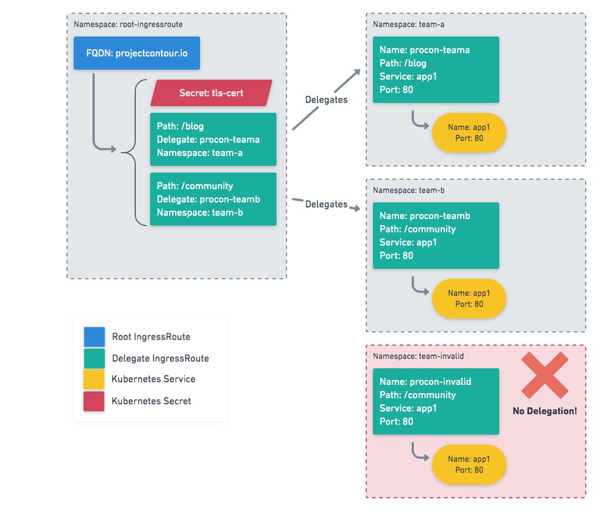

# Routing Design

_Status_: Draft

The IngressRoute design introduced in July 2018 the design chose to only support prefix matching for routes. This was mostly a time-to-market decision, but also reflected the fact that we didn't know other ways customers might want to match routes. We knew that Envoy also supported other methods, but without a signal from our user base, blindly adding support for all of the existing mechanisms felt like throwing the problem over the wall.

It's clear today that only supporting prefix routing is too limiting. Customers want to route not just on prefix, substring, and regex -- the three we identified last year -- but also header matching, source ip, user agent, and many more.

The scope of this design doc looks to improve on the IngressRoute.v1beta1 design and plan how the current design will change to support these additional routing features, yet still preserve the current multi-team capabilities through delegation.

# Background

There are many different ways to apply routing to L7 HTTP ingress controllers. The first few sections of this design outlines what might be possible with HTTP routing. So that it's clear, not all aspects of the available routing options will be implemented. Later on in the implementation sections, we'll walk through which pieces that this design doc looks to implement as well as types of routing that won't be addressed in this design document.

## Delegation

The working model for delegation is DNS. As the owner of a DNS domain, for example `.com`, I _delegate_ to another nameserver the responsibility for handing the subdomain `vmware.com`. Any nameserver can hold a record for `heptio.com`, but without the linkage from the parent `.com` TLD, its information is unreachable and non authoritative.

Each _root_ of a DAG starts at a virtual host, which describes properties such as the fully qualified name of the virtual host, TLS configuration, and possibly global access list details. The vertices of a graph do not contain virtual host information. Instead they are reachable from a root only by delegation. This permits the _owner_ of an ingress root to both delegate the authority to publish a service on a portion of the route space inside a virtual host, and to further delegate authority to publish and delegate.

In practice the linkage, or delegation, from root to vertex, is performed with a specific type of route action. You can think of it as routing traffic to another ingress route for further processing, instead of routing traffic directly to a service. How routing decisions are made is based upon the configuration for the route action. Detailed information regarding how Delegation functions can be found later on in the document in the "detailed design" sections.

### Delegation within Kubernetes

The delegation concept is a key component to enable teams within a single Kubernetes cluster as well as provide security for ingress limiting what users can specify within the cluster. Delegation allows for portions of a HTTP request to be delegated to a Kubernetes namespace. This allows teams to self-manage in a safe way portions of the http request. Users that do not have authority (or have not be delegated), cannot affect the routing configuration; their requests will be dropped. 

##### Root IngressRoutes

From the top, delegation is enforced through the use of `root ingressroute namespaces` which allow a cluster admin to carve off a set of namespaces where Contour's IngressRoutes will live. Any root IngressRoute found outside of these configured namespaces will be deemed invalid. 

Another design decision is that now TLS certificates, typically referenced via Kubernetes secrets, are placed inside these root ingressroute namespaces limiting the access required for Contour itself as well as not requiring these certs to exist in each team namespace. 

##### Delegated IngressRoutes

A delegated IngressRoute lives in each team namespace. Teams can self-manage their own resources based upon what has been delegated to them. Users can also create their own delegations to support their application infrastructure as they see fit. 

### Use Cases

Some use-cases for IngressRoute delegation:

- Restrict where TLS secrets exist in the cluster and who can access private keys
- Allow for a predictable routing decisions to eliminiate path conflicts
- Teams should be able to self-manage their own resources safely in a shared cluster without requiring administrative involvelement

### Example

The following example shows a root IngressRoute that manages the host `projectcontour.io`. It references a Kubernetes secret named `tls-cert` to allow for TLS termination. It delegates two paths to a set of teams in different namespaces. The path `/blog` is delegated to the IngressRoute named `procon-teama` in the namespace `team-a`. The path `/community` is delegated to the IngressRoute named `procon-teamb` in the namespace `team-b`. The IngressRoute named `procon-invalid` in the namespace `team-invalid` references the path `/community`, but no traffic is routed to it since a root IngressRoute doesn't delegate.



## Routing Mechanisms

As noted previously, there are various ways to make routing decisions. Contour was originally designed to support prefix path based routing; however, there are many other mechanisms that Contour could support. It's important to note that these routing mechanisms are taking into consideration ***after*** the virtual host routing decision is made:

- **Header:** Routing on an HTTP header that exists in the request (e.g. custom header, clientIP via header, HTTP method)
  - *Note: Still requires a path to match against*
- **Prefix Path:** The route matches the start of the :path header once the query string is removed
- **Exact Path:** The route is an exact path rule meaning that the path must exactly match the *:path* header once the query string is removed
- **Wildcard Path:** The route allows for a wildcard to be present in between two paths meaning that a portion of the path must match the *:path* header once the query string is removed.

### Header Routing

Routing via Header allows Contour to route traffic by more than just fqdn or path matching, but by also routing based upon a header which exists on the request.

#### Use Cases

- Allow for routing of platform to different backends. When a request come from an iOS device it should route to "backend-iOS" and requests from an Android device should route to "backend-Android". Each of these backends are managed by different teams and live in separate namespaces.

- Requests to a specific path `/weather` are handled by a backend, however, specific users are allowed to opt-in to a beta version. When authenticated, an additional header is added which identifies the user as a member of the "beta" program. Requests to the `/weather` path with the appropriate header (e.g. `X-Beta: true`) will route to `backend-beta`, all other requests will route to `backend-prod`.
  
- Similar to a opt-in beta version previously described, another header routing option is to route specific tenants to different backends. This may be to allows users to have a high tier of compute or run in segregated sections to limit where the data lives. When authenticated, an additional header is added which identifies the user as part of OrgA. The request is routed to the appropriate backend matching the user's organization membership.
  
- API Version Numbers in the header: Using a header to route requests to different backends based upon the header value (e.g. `apiversion: v2.0` vs `apiversion:v2.1-beta`)
  
- Does an Auth header exist in the request regardless of the value?

- Some headers will require a regex style expression for matching. If user wanted to target Chrome browsers, here's a sample header. We'd need to specify the `Chrome` bit out of the header value:

  ```bash
  Mozilla/5.0 (Macintosh; Intel Mac OS X 10_14_5) AppleWebKit/537.36 (KHTML, like Gecko) Chrome/74.0.3729.169 Safari/537.36
  ```

### Exact Path Routing

Exact Path based routing makes decisions based upon the path of the request (e.g. `/path`), where the path defined must match explicitly.

#### Use Cases

- Match only specific paths (i.e. `/path` should match but `/pathfoo` should ***not***), ensuring that only specified paths are served`

### Wilcard Path Routing

Wildcard path based routing allows for a portion of the path to be dynamic (e.g. /path/*/foo). This is useful to allow for many types of request paths to be routed to the same backed without specifying them explicitly up front.

#### Use Cases

- Match a wildcard in the middle of a path (e.g. `/app2/*/foo`)
- Allow for client id's to be placed into the request path for application use (e.g. `/app/<clientid>/foo`), where `clientid` is a specific id assigned by the application

## High-Level Design

### Header Routing

The IngressRoute spec will be updated to allow for a `header` field to be added which will allow for a set of key/value pairs to be applied to the route. Additionally, the path `match` moves to its own `path` variable. All the header key/values supplied will be taken into account when routing decisions are made.

- **header:** Key used to match a specific header in the request
- **value**: The value of the header matching the key specified

**NOTE**: *Routing on a `header` value* still requires a path prefix to be specified.

### Path Match with Headers

In the following example, you can define for path `/foo` and send traffic to different services for the same path but which contain different headers. This example shows how to have 2 routes match specific headers and a last route match a request without specific headers.

```yaml
apiVersion: projectcontour.io/v1
kind: IngressRoute
metadata: 
  name: example
spec:
  routes:
  - match:
      path: /foo
      - header: x-header
        value: a
    services:
    - name: backend-a
      port: 9999
  - match: 
      path: /foo
      - header: x-header
        value: b
    services:
    - name: backend-b
      port: 9999
  - match: 
    path: /foo
    services:
    - name: backend-default
      port: 9999
```

#### Requests

Following are sample requests and which backends will handle the request:

- `GET -H "x-header: a" /foo` —> `backend-a`
- `GET -H "x-header: b" /foo` —> `backend-b`
- `GET /foo` —>  `backend-default`

### Path Match with Cookie

In the following example, you can route any request to path `/foo` containing a cookie containing `user=test` to the backend named `cookiebackend` over port `80`.

```yaml
apiVersion: projectcontour.io/v1
kind: IngressRoute
metadata: 
  name: example
spec:
  routes:
  - match:
    path: /foo
    - header: cookie
      value: user=test
    services:
    - name: cookiebackend
      port: 80    
```

### Header Delegation

Currently with IngressRoute, path prefixes of a request can be delegated to teams, users, namespaces, within a single Kubernetes cluster. This design looks to add headers as a mechanism to pass authority off to teams, users or namespaces.

The following example shows how requests to a specific path with a specific header can be delegated to a team in another namespace as well as how requests that don't match the headers specified previously will be handled in the current namespace.

##### Root IngressRoute Example:

```yaml
apiVersion: projectcontour.io/v1
kind: IngressRoute
metadata: 
  name: example
spec:
  routes:
  - match:
    path: /foo
    - header: x-header
      value: a
    delegate:
      name: headera-ir
      namespace: team-a
  - match: 
      path: /foo
      - header: x-header
        value: b
      - user-agent: Chrome
    delegate:
      name: headerb-ir
      namespace: team-b
  - match: 
    path: /foo
    services:
    - name: backend-default
      port: 9999
```

##### Delegated IngressRoute Example:

```yaml
apiVersion: projectcontour.io/v1
kind: IngressRoute
metadata: 
  name: example
spec:
  routes:
  - match:
    path: /foo
    - header: x-header
      value: a
    - name: headerb-ir
      port: 80
  - match: 
      path: /foo
      - header: x-header
        value: b
      - header: user-agent 
        value: Chrome
    services:
    - name: headerb-ir
      port: 80
```

#### Requests

Following are sample requests and which backends will handle the request:

- `GET -H "x-header: a" /foo` —> `backend-a.team-a`
- `GET -H "x-header: b" /foo` —> `backend-b.team-b`
- `GET /foo` —>  `backend-default`

### Path Matching

Matching requests off of the HTTP request path is a core component of Contour. Path matching allows for applications to respond to specific portions of the request space. The following sections will outline the different path matching styles that Contour will support in IngressRoute/v1.

#### Path Prefix

A prefix-based match means a request will route if the first part of the defined path matches the first portion of the request. For example, if a path prefix `/foo` is specified, it will match `/foo`, `/foo/bar`, as well as `/foobar`. Basically, anything after `/foo` unless additional routes are further defined.

Users can specify a prefix match by utilizing the `prefix` attribute in the match spec of a route definition. 

Route delegation is possible with prefix matching.

*Note: This is a breaking change from IngressRoute/v1beta1*

##### Example:

```yaml
apiVersion: projectcontour.io/v1
kind: IngressRoute
metadata: 
  name: example
spec:
  routes:
  - match:
    prefix: /foo
    services:
    - name: prefix-service
      port: 80
```

#### Exact Match

Matching on a path prefix is not always desired if the application owner intends that only predefined paths will match. For example, if a exact path `/app` is specified, it will only match `/app`, all other paths will not match this route. Users can specify an exact match by utilizing the `path` attribute in the match spec of a route definition. 

Route delegation is still possible with an exact match since the path is still delegated, only the matching logic is changes between prefix or exact path matching. 

##### Example:

```yaml
apiVersion: projectcontour.io/v1
kind: IngressRoute
metadata: 
  name: example
spec:
  routes:
  - match:
    path: /app
    services:
    - name: exactmatch-service
      port: 80
```

#### Path Wildcard:

Another style of path matching is a wildcard style which allows for a portion of the path to be wildcarded. A wildcard match allows for a portion of a path to be dynamic.

For example, we could define a wildcard style path: `/app2/*/foo`, but not `/app2/*`. Wildcard paths are be able to delegated without issue as long as the `*` is bounded by paths. The previous example ending with `*` has too large of a match to allow for delegation. If this is encountered, Contour will set the status to be error for the corresponding IngressRoute.

*Note: The type of route match will still need to be specified (e.g. prefix, or path). The examples below show a `prefix` match, but a `path` match would work as well.*

##### Root IngressRoute:

```yaml
apiVersion: projectcontour.io/v1
kind: IngressRoute
metadata: 
  name: example
spec:
  routes:
  - match:
    prefix: /app/*/foo  
    delegate:
      name: wildcard
      namespace: prefix
```

##### Delegate IngressRoute:

```yaml
apiVersion: projectcontour.io/v1
kind: IngressRoute
metadata: 
  name: example
spec:
  routes:
  - match:
    prefix: /app/*/foo  
    services:
    - name: wildcard-service
      port: 80
```

##### Requests

Following are sample requests and which backends will handle the request:

- `GET /app/bar/foo` —> `wildcard-service`
- `GET /app/zed/foo` —> `wildcard-service`
- `GET /app/bar/foo/something` —> `wildcard-service`

## Security Considerations

- If the delegation is not properly implemented, there could be ways that users get access to portions of the host requests which they should not have access. This will need to be mitigated with proper testing and validation of the design implementation.
